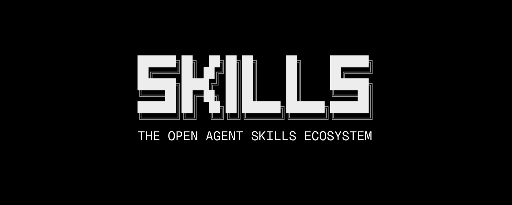
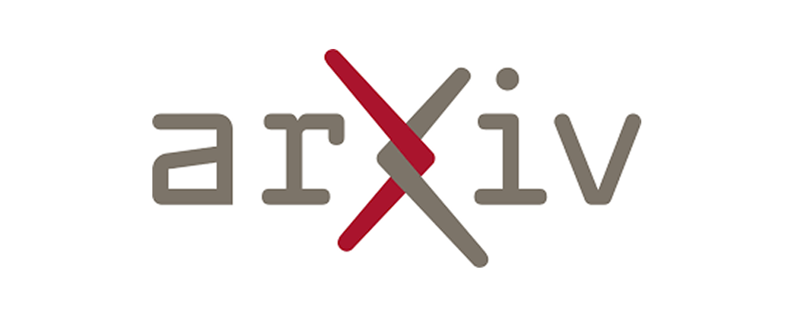

# 📰 AI & CG 每日资讯 - 2026-01-28

> 自动生成于 2026-01-28 22:05:02

## 🔥 GitHub Trending

    

        

            TypeScript
            Today
        

        <a href="https://github.com/badlogic/pi-mono" target="_blank" class="news-title-link">
            <h3 class="news-title">pi-mono</h3>
        </a>
        
AI 代理工具包：编码代理 CLI、统一 LLM API、TUI 和 Web UI 库、Slack 机器人、vLL...

        

            🔤 TypeScript
            ⭐ +469
        

    

    

    

        

            C++
            Today
        

        <a href="https://github.com/ran-j/PS2Recomp" target="_blank" class="news-title-link">
            <h3 class="news-title">PS2Recomp</h3>
        </a>
        
Playstation 2 静态重新编译器和运行时工具，用于制作本机 PC 端口

        

            🔤 C++
            ⭐ +467
        

    

    

    

        

            Go
            Today
        

        <a href="https://github.com/hashicorp/vault" target="_blank" class="news-title-link">
            <h3 class="news-title">vault</h3>
        </a>
        
用于秘密管理、加密即服务和特权访问管理的工具

        

            🔤 Go
            ⭐ +356
        

    

    

    

        

            Python
            Today
        

        <a href="https://github.com/MoonshotAI/kimi-cli" target="_blank" class="news-title-link">
            <h3 class="news-title">kimi-cli</h3>
        </a>
        
Kimi Code CLI 是您的下一个 CLI 代理。

        

            🔤 Python
            ⭐ +293
        

    

    

    

        

            JavaScript
            Today
        

        <a href="https://github.com/asgeirtj/system_prompts_leaks" target="_blank" class="news-title-link">
            <h3 class="news-title">system_prompts_leaks</h3>
        </a>
        
从 ChatGPT、Claude 和 Gemini 等流行聊天机器人中提取的系统提示的集合

        

            🔤 JavaScript
            ⭐ +241
        

    

    

    

        

            Python
            Today
        

        <a href="https://github.com/NevaMind-AI/memU" target="_blank" class="news-title-link">
            <h3 class="news-title">memU</h3>
        </a>
        
24/7 主动代理的内存，例如 moltbot (clawdbot)。

        

            🔤 Python
            ⭐ +231
        

    

    

    

        

            TypeScript
            Today
        

        <a href="https://github.com/lobehub/lobehub" target="_blank" class="news-title-link">
            <h3 class="news-title">lobehub</h3>
        </a>
        
工作和生活的终极空间 - 寻找、建立并与与您一起成长的代理团队成员进行协作。我们正在将代理安全带带入下一个阶段

        

            🔤 TypeScript
            ⭐ +132
        

    

    

    

        

            Python
            Today
        

        <a href="https://github.com/GetStream/Vision-Agents" target="_blank" class="news-title-link">
            <h3 class="news-title">Vision-Agents</h3>
        </a>
        
通过 Stream 打开 Vision Agent。与任何模型或视频提供商一起快速构建 Vision Agent。...

        

            🔤 Python
            ⭐ +89
        

    

    

    

        

            C++
            Today
        

        <a href="https://github.com/bambulab/BambuStudio" target="_blank" class="news-title-link">
            <h3 class="news-title">BambuStudio</h3>
        </a>
        
适用于 BambuLab 和其他 3D 打印机的 PC 软件

        

            🔤 C++
            ⭐ +27
        

    

    

    

        

            Go
            Today
        

        <a href="https://github.com/kubernetes/ingress-nginx" target="_blank" class="news-title-link">
            <h3 class="news-title">ingress-nginx</h3>
        </a>
        
Kubernetes 的入口 NGINX 控制器

        

            🔤 Go
            ⭐ +28
        

    

    

## 🛠️ Trending Skills for Agents

> Top Agent Skills from skills.sh

    

        

            Agent Skill
            Today
        

        <a href="https://skills.sh/vercel-labs/skills/find-skills" target="_blank" class="news-title-link">
            <h3 class="news-title">find-skills</h3>
        </a>
        
Rank #1 on skills.sh. Owner: vercel-labs/skills

        

            🤖 Skill
            #1
        

    

    

    

        

            Agent Skill
            Today
        

        <a href="https://skills.sh/vercel-labs/agent-skills/vercel-react-best-practices" target="_blank" class="news-title-link">
            <h3 class="news-title">vercel-react-best-practices</h3>
        </a>
        
Rank #2 on skills.sh. Owner: vercel-labs/agent-skills

        

            🤖 Skill
            #2
        

    

    

    

        

            Agent Skill
            Today
        

        <a href="https://skills.sh/remotion-dev/skills/remotion-best-practices" target="_blank" class="news-title-link">
            <h3 class="news-title">remotion-best-practices</h3>
        </a>
        
Rank #3 on skills.sh. Owner: remotion-dev/skills

        

            🤖 Skill
            #3
        

    

    

    

        

            Agent Skill
            Today
        

        <a href="https://skills.sh/vercel-labs/agent-skills/web-design-guidelines" target="_blank" class="news-title-link">
            <h3 class="news-title">web-design-guidelines</h3>
        </a>
        
Rank #4 on skills.sh. Owner: vercel-labs/agent-skills

        

            🤖 Skill
            #4
        

    

    

    

        

            Agent Skill
            Today
        

        <a href="https://skills.sh/vercel-labs/agent-skills/vercel-composition-patterns" target="_blank" class="news-title-link">
            <h3 class="news-title">vercel-composition-patterns</h3>
        </a>
        
Rank #5 on skills.sh. Owner: vercel-labs/agent-skills

        

            🤖 Skill
            #5
        

    

    

    

        

            Agent Skill
            Today
        

        <a href="https://skills.sh/anthropics/skills/frontend-design" target="_blank" class="news-title-link">
            <h3 class="news-title">frontend-design</h3>
        </a>
        
Rank #6 on skills.sh. Owner: anthropics/skills

        

            🤖 Skill
            #6
        

    

    

    

        

            Agent Skill
            Today
        

        <a href="https://skills.sh/vercel-labs/agent-skills/vercel-react-native-skills" target="_blank" class="news-title-link">
            <h3 class="news-title">vercel-react-native-skills</h3>
        </a>
        
Rank #7 on skills.sh. Owner: vercel-labs/agent-skills

        

            🤖 Skill
            #7
        

    

    

    

        

            Agent Skill
            Today
        

        <a href="https://skills.sh/vercel-labs/agent-browser/agent-browser" target="_blank" class="news-title-link">
            <h3 class="news-title">agent-browser</h3>
        </a>
        
Rank #8 on skills.sh. Owner: vercel-labs/agent-browser

        

            🤖 Skill
            #8
        

    

    

    

        

            Agent Skill
            Today
        

        <a href="https://skills.sh/browser-use/browser-use/browser-use" target="_blank" class="news-title-link">
            <h3 class="news-title">browser-use</h3>
        </a>
        
Rank #9 on skills.sh. Owner: browser-use/browser-use

        

            🤖 Skill
            #9
        

    

    

    

        

            Agent Skill
            Today
        

        <a href="https://skills.sh/atxp-dev/cli/atxp" target="_blank" class="news-title-link">
            <h3 class="news-title">atxp</h3>
        </a>
        
Rank #10 on skills.sh. Owner: atxp-dev/cli

        

            🤖 Skill
            #10
        

    

    

## 🤗 Hugging Face Papers

> Daily Top Papers from hf.co/papers

    

        

            Paper
            2026-01-26T13:45:41.000Z
        

        <a href="https://huggingface.co/papers/2601.18491" target="_blank" class="news-title-link">
            <h3 class="news-title">AgentDoG: A Diagnostic Guardrail Framework for AI Agent Safety and Security</h3>
        </a>
        
人工智能代理面临着来自自主工具使用和环境交互的安全挑战，需要先进的护栏框架来进行风险诊断和透明监控。

        

            📄 Paper
            👍 54
        

    

    

    

        

            Paper
            2026-01-26T16:04:43.000Z
        

        <a href="https://huggingface.co/papers/2601.18631" target="_blank" class="news-title-link">
            <h3 class="news-title">AdaReasoner: Dynamic Tool Orchestration for Iterative Visual Reasoning</h3>
        </a>
        
AdaReasoner 使多模态模型能够通过可扩展的数据管理、工具选择的强化学习以及提高复杂视觉推理任务性能的自适应学习机制来学习工具使用作为一般推理技能。

        

            📄 Paper
            👍 36
        

    

    

    

        

            Paper
            2026-01-26T17:08:04.000Z
        

        <a href="https://huggingface.co/papers/2601.18692" target="_blank" class="news-title-link">
            <h3 class="news-title">A Pragmatic VLA Foundation Model</h3>
        </a>
        
在广泛的现实世界机器人数据上训练的视觉-语言-动作模型展示了跨多个平台的卓越性能和泛化性，同时通过优化的培训基础设施提供了更高的效率。

        

            📄 Paper
            👍 23
        

    

    

    

        

            Paper
            2026-01-14T04:45:05.000Z
        

        <a href="https://huggingface.co/papers/2601.09150" target="_blank" class="news-title-link">
            <h3 class="news-title">World Craft: Agentic Framework to Create Visualizable Worlds via Text</h3>
        </a>
        
World Craft 使非专家用户能够通过文本描述、结合结构化脚手架和多智能体意图分析来创建可执行和可视化的 AI 环境。

        

            📄 Paper
            👍 15
        

    

    

    

        

            Paper
            2026-01-26T04:00:56.000Z
        

        <a href="https://huggingface.co/papers/2601.18116" target="_blank" class="news-title-link">
            <h3 class="news-title">FABLE: Forest-Based Adaptive Bi-Path LLM-Enhanced Retrieval for Multi-Document Reasoning</h3>
        </a>
        
FABLE 是一种基于森林的自适应双路径检索框架，它通过分层索引和结构化证据获取增强基于 LLM 的信息检索，与传统 RAG 方法相比，通过减少令牌使用来...

        

            📄 Paper
            👍 9
        

    

    

    

        

            Paper
            2026-01-26T09:21:43.000Z
        

        <a href="https://huggingface.co/papers/2601.18292" target="_blank" class="news-title-link">
            <h3 class="news-title">TriPlay-RL: Tri-Role Self-Play Reinforcement Learning for LLM Safety Alignment</h3>
        </a>
        
闭环强化学习框架支持攻击者、防御者和评估者角色之间的迭代协作，以改进大语言模型的安全对齐，而无需手动注释。

        

            📄 Paper
            👍 9
        

    

    

    

        

            Paper
            2026-01-27T18:58:46.000Z
        

        <a href="https://huggingface.co/papers/2601.19895" target="_blank" class="news-title-link">
            <h3 class="news-title">Post-LayerNorm Is Back: Stable, ExpressivE, and Deep</h3>
        </a>
        
一种名为 Keel 的新型 Post-LayerNorm Transformer 架构通过用 Highway 式连接替换残余连接来解决极深网络中的训练不稳...

        

            📄 Paper
            👍 4
        

    

    

    

        

            Paper
            2026-01-26T17:48:23.000Z
        

        <a href="https://huggingface.co/papers/2601.18724" target="_blank" class="news-title-link">
            <h3 class="news-title">HalluCitation Matters: Revealing the Impact of Hallucinated References with 300 Hallucinated Papers in ACL Conferences</h3>
        </a>
        
幻觉引用被定义为对不存在的作品的错误引用，在最近的 NLP 会议出版物中普遍存在，对科学可靠性和会议可信度具有重大影响。

        

            📄 Paper
            👍 3
        

    

    

    

        

            Paper
            2026-01-26T01:53:54.000Z
        

        <a href="https://huggingface.co/papers/2601.18067" target="_blank" class="news-title-link">
            <h3 class="news-title">EvolVE: Evolutionary Search for LLM-based Verilog Generation and Optimization</h3>
        </a>
        
Verilog 的设计周期本质上是劳动密集型的，并且需要广泛的领域专业知识。尽管大型语言模型 (LLM) 提供了一条有希望的自动化途径，但其有限的训练数据...

        

            📄 Paper
            👍 0
        

    

    

    

        

            Paper
            2026-01-27T12:20:44.000Z
        

        <a href="https://huggingface.co/papers/2601.19532" target="_blank" class="news-title-link">
            <h3 class="news-title">Benchmarks Saturate When The Model Gets Smarter Than The Judge</h3>
        </a>
        
通过手动审核创建了修订后的数学基准数据集，以减少噪音并提高模型性能评估的准确性。

        

            📄 Paper
            👍 0
        

    

    

## 🚀 Product Hunt 每日精选

    

        

            Product
            Today
        

        <a href="https://www.producthunt.com/products/imagine-2" target="_blank" class="news-title-link">
            <h3 class="news-title">Imagine</h3>
        </a>
        
使用最完整的 AI 构建器构建真实的东西关联

        

            🆕 Product
            ▲ 0
        

    

    

    

        

            Product
            Today
        

        <a href="https://www.producthunt.com/products/invofox" target="_blank" class="news-title-link">
            <h3 class="news-title">Invofox</h3>
        </a>
        
供开发人员使用的文档解析 API 讨论 |关联

        

            🆕 Product
            ▲ 0
        

    

    

    

        

            Product
            Today
        

        <a href="https://www.producthunt.com/products/datafast" target="_blank" class="news-title-link">
            <h3 class="news-title">DataFast</h3>
        </a>
        
收入优先分析讨论 |关联

        

            🆕 Product
            ▲ 0
        

    

    

    

        

            Product
            Today
        

        <a href="https://www.producthunt.com/products/what-s-in-that-direction" target="_blank" class="news-title-link">
            <h3 class="news-title">What’s in that direction?</h3>
        </a>
        
显示地标、日出/日落+黄金时段的指南针关联

        

            🆕 Product
            ▲ 0
        

    

    

    

        

            Product
            Today
        

        <a href="https://www.producthunt.com/products/edit-mind-2" target="_blank" class="news-title-link">
            <h3 class="news-title">Edit Mind</h3>
        </a>
        
AI 支持的本地视频搜索和分析讨论 |关联

        

            🆕 Product
            ▲ 0
        

    

    

    

        

            Product
            Today
        

        <a href="https://www.producthunt.com/products/autosend-2" target="_blank" class="news-title-link">
            <h3 class="news-title">AutoSend</h3>
        </a>
        
面向开发人员、营销人员和 AI 代理讨论的电子邮件 |关联

        

            🆕 Product
            ▲ 0
        

    

    

    

        

            Product
            Today
        

        <a href="https://www.producthunt.com/products/cloakly" target="_blank" class="news-title-link">
            <h3 class="news-title">Cloakly</h3>
        </a>
        
在屏幕共享期间隐藏应用程序 - 保持您的桌面私密关联

        

            🆕 Product
            ▲ 0
        

    

    

    

        

            Product
            Today
        

        <a href="https://www.producthunt.com/products/kuku" target="_blank" class="news-title-link">
            <h3 class="news-title">kuku</h3>
        </a>
        
黑曜石——但很多事情都发生了变化关联

        

            🆕 Product
            ▲ 0
        

    

    

    

        

            Product
            Today
        

        <a href="https://www.producthunt.com/products/rumora" target="_blank" class="news-title-link">
            <h3 class="news-title">Rumora</h3>
        </a>
        
在病毒式传播的 TikTok 和 YouTube 视频中宣传您的品牌关联

        

            🆕 Product
            ▲ 0
        

    

    

    

        

            Product
            Today
        

        <a href="https://www.producthunt.com/products/polyglotta" target="_blank" class="news-title-link">
            <h3 class="news-title">Polyglotta</h3>
        </a>
        
一次翻译和学习多种语言 讨论 |关联

        

            🆕 Product
            ▲ 0
        

    

    

## 🎨 CG 图形学

> 覆盖: Unreal Engine | Three.js | Blender | Houdini | Unity | Godot | NVIDIA

    

        

            UE Official
            Tue, 20 Jan 2026 00:00:00 GMT
        

        <a href="https://www.unrealengine.com/events/unreal-fest-chicago-2026" target="_blank" class="news-title-link">
            <h3 class="news-title">Unreal Fest Chicago 2026</h3>
        </a>
        
2026 年芝加哥虚幻音乐节

        

            🏛️ 官方 🤖 AI
            🔥 100
        

    

    

    

        

            Blender Official
            Thu, 13 Nov 2025 17:42:11 +0000
        

        <a href="https://www.blender.org/news/give-back-to-blender-fundraiser-for-2026/" target="_blank" class="news-title-link">
            <h3 class="news-title">Give Back to Blender – Fundraiser for 2026</h3>
        </a>
        
回馈 Blender – 2026 年筹款活动

        

            🏛️ 官方 🤖 AI
            🔥 100
        

    

    

    

        

            Unity Official
            Wed, 07 Jan 2026 00:00:00 GMT
        

        <a href="https://unity.com/blog/unity-for-humanity-2026-grant-now-open" target="_blank" class="news-title-link">
            <h3 class="news-title">Unity for Humanity 2026 grant now open</h3>
        </a>
        
Unity for Humanity 2026 赠款现已开放

        

            🏛️ 官方 🤖 AI
            🔥 100
        

    

    

    

        

            Godot Official
            Mon, 26 Jan 2026 17:00:00 +0000
        

        <a href="https://godotengine.org/article/godot-4-6-all-about-your-flow/" target="_blank" class="news-title-link">
            <h3 class="news-title">Godot 4.6 – All about your flow</h3>
        </a>
        
Godot 4.6 – 关于流程的一切

        

            🏛️ 官方 🤖 AI
            🔥 100
        

    

    

    

        

            NVIDIA Dev
            2026-01-27T19:00:00Z
        

        <a href="https://developer.nvidia.com/blog/accelerating-diffusion-models-with-an-open-plug-and-play-offering/" target="_blank" class="news-title-link">
            <h3 class="news-title">Accelerating Diffusion Models with an Open, Plug-and-Play Offering</h3>
        </a>
        
通过开放、即插即用的产品加速扩散模型

        

            🏛️ 官方 🤖 AI
            🔥 100
        

    

    

    

        

            Unity Official
            Tue, 06 Jan 2026 00:00:00 GMT
        

        <a href="https://unity.com/blog/games/games-made-with-unity-2025-releases" target="_blank" class="news-title-link">
            <h3 class="news-title">Games made with Unity: 2025 in review</h3>
        </a>
        
使用 Unity 制作的游戏：2025 年回顾

        

            🏛️ 官方 🤖 AI
            🔥 100
        

    

    

    

        

            Godot Official
            Fri, 23 Jan 2026 22:00:00 +0000
        

        <a href="https://godotengine.org/article/release-candidate-godot-4-5-2-rc-1/" target="_blank" class="news-title-link">
            <h3 class="news-title">Release candidate: Godot 4.5.2 RC 1</h3>
        </a>
        
候选版本：Godot 4.5.2 RC 1

        

            🏛️ 官方 🤖 AI
            🔥 100
        

    

    

    

        

            Godot Official
            Tue, 20 Jan 2026 12:00:00 +0000
        

        <a href="https://godotengine.org/article/release-candidate-godot-4-6-rc-2/" target="_blank" class="news-title-link">
            <h3 class="news-title">Release candidate: Godot 4.6 RC 2</h3>
        </a>
        
候选版本：Godot 4.6 RC 2

        

            🏛️ 官方 🤖 AI
            🔥 100
        

    

    

    

        

            NVIDIA Dev
            2026-01-26T21:00:00Z
        

        <a href="https://developer.nvidia.com/blog/adaptive-inference-in-nvidia-tensorrt-for-rtx-enables-automatic-optimization/" target="_blank" class="news-title-link">
            <h3 class="news-title">Adaptive Inference in NVIDIA TensorRT for RTX Enables Automatic Optimization</h3>
        </a>
        
NVIDIA TensorRT for RTX 中的自适应推理可实现自动优化

        

            🏛️ 官方 🤖 AI
            🔥 100
        

    

    

    

        

            NVIDIA Dev
            2026-01-26T14:00:00Z
        

        <a href="https://developer.nvidia.com/blog/how-to-unlock-local-detail-in-coarse-climate-projections-with-nvidia-earth-2/" target="_blank" class="news-title-link">
            <h3 class="news-title">How to Unlock Local Detail in Coarse Climate Projections with NVIDIA Earth-2</h3>
        </a>
        
如何使用 NVIDIA Earth-2 解锁粗略气候预测中的局部细节

        

            🏛️ 官方 🤖 AI
            🔥 100
        

    

    

    

        

            Three.js Releases
            2025-12-10T19:05:36Z
        

        <a href="https://github.com/mrdoob/three.js/releases/tag/r182" target="_blank" class="news-title-link">
            <h3 class="news-title">r182</h3>
        </a>
        
r182

        

            🏛️ 官方
            🔥 50
        

    

    

    

        

            UE Official
            Tue, 27 Jan 2026 18:38:27 GMT
        

        <a href="https://forums.unrealengine.com/t/power-up-your-metasound-workflows-with-techaudiotools-content/2695319" target="_blank" class="news-title-link">
            <h3 class="news-title">Power up your MetaSound workflows with TechAudioTools Content</h3>
        </a>
        
使用 TechAudioTools 内容增强您的 MetaSound 工作流程

        

            🏛️ 官方
            🔥 50
        

    

    

    

        

            UE Official
            Thu, 22 Jan 2026 00:00:00 GMT
        

        <a href="https://www.unrealengine.com/news/fab-2025-year-in-review" target="_blank" class="news-title-link">
            <h3 class="news-title">Fab 2025 Year in Review</h3>
        </a>
        
Fab 2025 年回顾

        

            🏛️ 官方
            🔥 50
        

    

    

    

        

            UE Official
            Fri, 16 Jan 2026 00:00:00 GMT
        

        <a href="https://www.unrealengine.com/spotlights/oddbot-reinvents-its-animation-pipeline-for-playdate-with-winnie-the-pooh" target="_blank" class="news-title-link">
            <h3 class="news-title">OddBot reinvents its animation pipeline for Playdate with Winnie the Pooh</h3>
        </a>
        
OddBot 与小熊维尼一起重塑 Playdate 的动画流程

        

            🏛️ 官方
            🔥 50
        

    

    

    

        

            UE Official
            Tue, 13 Jan 2026 00:00:00 GMT
        

        <a href="https://www.unrealengine.com/news/the-fab-new-year-sale-is-now-on" target="_blank" class="news-title-link">
            <h3 class="news-title">The Fab New Year Sale is now on!</h3>
        </a>
        
Fab 新年特卖现已开始！

        

            🏛️ 官方
            🔥 50
        

    

    

## 💬 Hacker News 热议

    

        

            Discussion
            Today
        

        <a href="https://www.vectorware.com/blog/rust-std-on-gpu/" target="_blank" class="news-title-link">
            <h3 class="news-title">Rust’s Standard Library on the GPU</h3>
        </a>
        
GPU 上的 Rust 标准库

        

            💬 39 评论
            Points: 208
        

    

    

    

        

            Discussion
            Today
        

        <a href="https://allenai.org/blog/open-coding-agents" target="_blank" class="news-title-link">
            <h3 class="news-title">AI2: Open Coding Agents</h3>
        </a>
        
AI2：开放编码代理

        

            💬 35 评论
            Points: 209
        

    

    

    

        

            Discussion
            Today
        

        <a href="https://aisle.com/blog/aisle-discovered-12-out-of-12-openssl-vulnerabilities" target="_blank" class="news-title-link">
            <h3 class="news-title">AISLE’s autonomous analyzer found all CVEs in the January OpenSSL release</h3>
        </a>
        
AISLE 的自主分析器发现了 1 月份 OpenSSL 版本中的所有 CVE

        

            💬 122 评论
            Points: 175
        

    

    

    

        

            Discussion
            Today
        

        <a href="https://www.oneusefulthing.org/p/management-as-ai-superpower" target="_blank" class="news-title-link">
            <h3 class="news-title">Management as AI superpower: Thriving in a world of agentic AI</h3>
        </a>
        
管理作为人工智能的超级力量：在代理人工智能的世界中蓬勃发展

        

            💬 86 评论
            Points: 90
        

    

    

    

        

            Discussion
            Today
        

        <a href="https://infocom.tambo.co/" target="_blank" class="news-title-link">
            <h3 class="news-title">Show HN: I wrapped the Zorks with an LLM</h3>
        </a>
        
Show HN：我用法学硕士包裹了 Zorks

        

            💬 54 评论
            Points: 94
        

    

    

    

        

            Discussion
            Today
        

        <a href="https://www.bbc.com/news/articles/c1evvx89559o" target="_blank" class="news-title-link">
            <h3 class="news-title">Heathrow scraps liquid container limit</h3>
        </a>
        
希思罗机场取消液体容器限制

        

            💬 793 评论
            Points: 616
        

    

    

    

        

            Discussion
            Today
        

        <a href="https://falconer.com/notes/llm-as-a-courtroom/" target="_blank" class="news-title-link">
            <h3 class="news-title">LLM-as-a-Courtroom</h3>
        </a>
        
法学硕士作为法庭

        

            💬 29 评论
            Points: 64
        

    

    

    

        

            Discussion
            Today
        

        <a href="https://tailscale.com/blog/aperture-private-alpha" target="_blank" class="news-title-link">
            <h3 class="news-title">A first look at Aperture by Tailscale (private alpha)</h3>
        </a>
        
初看 Aperture by Tailscale（私人 alpha）

        

            💬 37 评论
            Points: 97
        

    

    

    

        

            Discussion
            Today
        

        <a href="https://www.apple.com/newsroom/2026/01/apple-introduces-new-airtag-with-expanded-range-and-improved-findability/" target="_blank" class="news-title-link">
            <h3 class="news-title">Apple introduces new AirTag with longer range and improved findability</h3>
        </a>
        
苹果推出新的 AirTag，具有更远的射程和更高的可发现性

        

            💬 724 评论
            Points: 593
        

    

    

    

        

            Discussion
            Today
        

        <a href="https://twitter.com/lellouchenico/status/2015775970330882319" target="_blank" class="news-title-link">
            <h3 class="news-title">France Aiming to Replace Zoom, Google Meet, Microsoft Teams, etc.</h3>
        </a>
        
法国旨在取代 Zoom、Google Meet、Microsoft Teams 等

        

            💬 757 评论
            Points: 880
        

    

    

## 🎓 学术前沿 (arXiv)

    

        

            cs.GR
            2026-01-27T17:50:07Z
        

        <a href="https://arxiv.org/pdf/2601.19843v1" target="_blank" class="news-title-link">
            <h3 class="news-title">Graphical X Splatting (GraphiXS): A Graphical Model for 4D Gaussian Splatting under Uncertainty</h3>
        </a>
        
图形 X 泼溅 (GraphiXS)：不确定性下 4D 高斯泼溅的图形模型

        

            ✍️ He Wang
            📄 PDF
        

    

    

    

        

            cs.GR
            2026-01-27T07:48:59Z
        

        <a href="https://arxiv.org/pdf/2601.19310v1" target="_blank" class="news-title-link">
            <h3 class="news-title">ClipGS-VR: Immersive and Interactive Cinematic Visualization of Volumetric Medical Data in Mobile Virtual Reality</h3>
        </a>
        
ClipGS-VR：移动虚拟现实中体积医疗数据的沉浸式交互式电影可视化

        

            ✍️ Pheng-Ann Heng
            📄 PDF
        

    

    

    

        

            cs.GR
            2026-01-27T06:05:14Z
        

        <a href="https://arxiv.org/pdf/2601.19233v1" target="_blank" class="news-title-link">
            <h3 class="news-title">UniMGS: Unifying Mesh and 3D Gaussian Splatting with Single-Pass Rasterization and Proxy-Based Deformation</h3>
        </a>
        
UniMGS：通过单通道光栅化和基于代理的变形来统一网格和 3D 高斯分布

        

            ✍️ Lihua Zhang
            📄 PDF
        

    

    

    

        

            cs.GR
            2026-01-26T15:32:16Z
        

        <a href="https://arxiv.org/pdf/2601.18585v1" target="_blank" class="news-title-link">
            <h3 class="news-title">GimmBO: Interactive Generative Image Model Merging via Bayesian Optimization</h3>
        </a>
        
GimmBO：通过贝叶斯优化的交互式生成图像模型合并

        

            ✍️ Alec Jacobson
            📄 PDF
        

    

    

    

        

            cs.CV
            2026-01-27T17:56:49Z
        

        <a href="https://arxiv.org/pdf/2601.19849v1" target="_blank" class="news-title-link">
            <h3 class="news-title">HexFormer: Hyperbolic Vision Transformer with Exponential Map Aggregation</h3>
        </a>
        
HexFormer：具有指数映射聚合的双曲视觉变换器

        

            ✍️ Lars Schmidt-Thieme
            📄 PDF
        

    

    

    

        

            cs.CV
            2026-01-27T16:47:35Z
        

        <a href="https://arxiv.org/pdf/2601.19785v1" target="_blank" class="news-title-link">
            <h3 class="news-title">GeoDiff3D: Self-Supervised 3D Scene Generation with Geometry-Constrained 2D Diffusion Guidance</h3>
        </a>
        
GeoDiff3D：具有几何约束的 2D 扩散指导的自监督 3D 场景生成

        

            ✍️ Fenggen Yu
            📄 PDF
        

    

    

    

        

            cs.AI
            2026-01-27T17:45:04Z
        

        <a href="https://arxiv.org/pdf/2601.19839v1" target="_blank" class="news-title-link">
            <h3 class="news-title">HARMONI: Multimodal Personalization of Multi-User Human-Robot Interactions with LLMs</h3>
        </a>
        
HARMONI：与法学硕士的多用户人机交互的多模式个性化

        

            ✍️ Mohamed Chetouani
            📄 PDF
        

    

    

    

        

            cs.AI
            2026-01-27T17:40:07Z
        

        <a href="https://arxiv.org/pdf/2601.19834v1" target="_blank" class="news-title-link">
            <h3 class="news-title">Visual Generation Unlocks Human-Like Reasoning through Multimodal World Models</h3>
        </a>
        
视觉生成通过多模态世界模型解锁类人推理

        

            ✍️ Mingsheng Long
            📄 PDF
        

    

    

    

        

            cs.AI
            2026-01-27T17:35:05Z
        

        <a href="https://arxiv.org/pdf/2601.19827v1" target="_blank" class="news-title-link">
            <h3 class="news-title">When Iterative RAG Beats Ideal Evidence: A Diagnostic Study in Scientific Multi-hop Question Answering</h3>
        </a>
        
当迭代 RAG 击败理想证据时：科学多跳问答的诊断研究

        

            ✍️ Soheila Samiee
            📄 PDF
        

    

    

    

        

            cs.GR
            2026-01-27T11:58:34Z
        

        <a href="https://arxiv.org/pdf/2601.19519v1" target="_blank" class="news-title-link">
            <h3 class="news-title">Mocap Anywhere: Towards Pairwise-Distance based Motion Capture in the Wild (for the Wild)</h3>
        </a>
        
Mocap Anywhere：在野外进行基于成对距离的动作捕捉（for the Wild）

        

            ✍️ Andreas Aristidou
            📄 PDF
        

    

    

---
*本报告由 AI & CG News Aggregator Skill 自动生成*