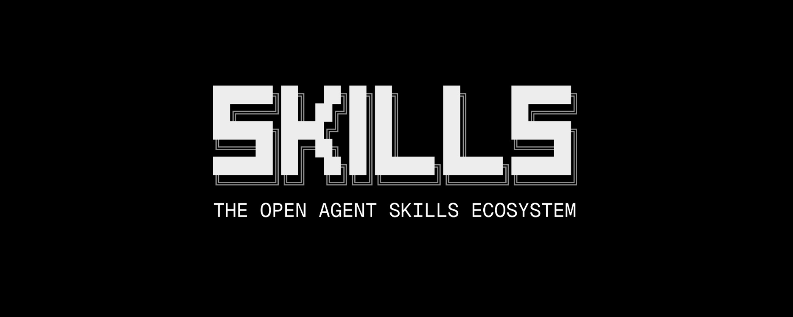
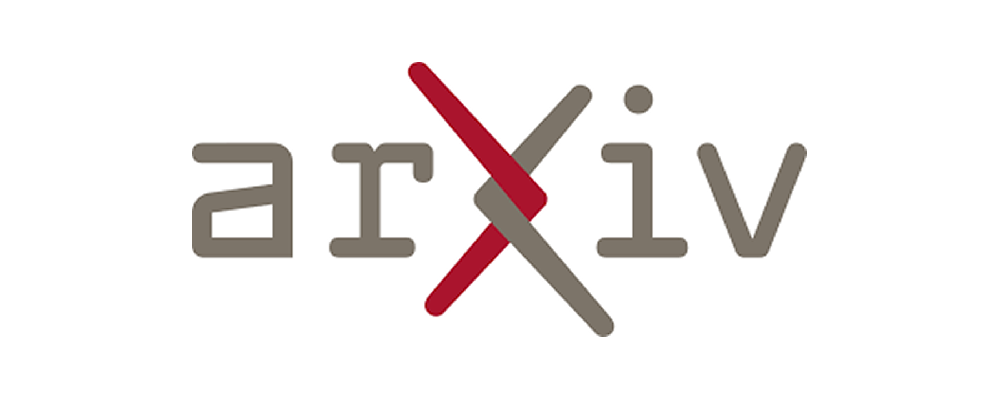

# 📰 AI & CG 每日资讯 - 2026-03-19

> 自动生成于 2026-03-19 09:02:41

## 🔥 GitHub Trending

["开源项目"]

GitHub

<a href="https://github.com/obra/superpowers" target="_blank" class="news-title-link">
<h3 class="news-title">superpowers</h3>
</a>

有效的代理技能框架和软件开发方法。

        
开源项目

🔤 Shell
⭐ +4089

["开源项目", "大语言模型"]

GitHub

<a href="https://github.com/jarrodwatts/claude-hud" target="_blank" class="news-title-link">
<h3 class="news-title">claude-hud</h3>
</a>

一个 Claude Code 插件，显示正在发生的事情 - 上下文使用、活动工具、正在运行的代理和待办事项进度

        
开源项目 大语言模型

🔤 JavaScript
⭐ +1038

["开源项目", "大语言模型"]

GitHub

<a href="https://github.com/unslothai/unsloth" target="_blank" class="news-title-link">
<h3 class="news-title">unsloth</h3>
</a>

统一的 Web UI，用于在本地训练和运行 Qwen、DeepSeek、gpt-oss 和 Gemma 等开放模型。

        
开源项目 大语言模型

🔤 Python
⭐ +1005

["开源项目"]

GitHub

<a href="https://github.com/langchain-ai/open-swe" target="_blank" class="news-title-link">
<h3 class="news-title">open-swe</h3>
</a>

开源异步编码代理

        
开源项目

🔤 Python
⭐ +481

["开源项目"]

GitHub

<a href="https://github.com/shadps4-emu/shadPS4" target="_blank" class="news-title-link">
<h3 class="news-title">shadPS4</h3>
</a>

用 C++ 编写的适用于 Windows、Linux 和 macOS 的 PlayStation 4 模拟器

        
开源项目

🔤 C++
⭐ +237

["论文/研究", "开源项目"]

GitHub

<a href="https://github.com/newton-physics/newton" target="_blank" class="news-title-link">
<h3 class="news-title">newton</h3>
</a>

一款基于 NVIDIA Warp 构建的开源 GPU 加速物理模拟​​引擎，专门针对机器人专家和模拟研究人员。

        
论文/研究 开源项目

🔤 Python
⭐ +26

## 🛠️ Trending Skills for Agents

> Top Agent Skills from skills.sh

["AI Agent", "Skill"]

Skills.sh

<a href="https://skills.sh/vercel-labs/skills/find-skills" target="_blank" class="news-title-link">
<h3 class="news-title">find-skills</h3>
</a>

Rank #1 on skills.sh. Owner: vercel-labs/skills

        
AI Agent Skill

🤖 Skill
#1

["AI Agent", "Skill"]

Skills.sh

<a href="https://skills.sh/microsoft/azure-skills/microsoft-foundry" target="_blank" class="news-title-link">
<h3 class="news-title">microsoft-foundry</h3>
</a>

Rank #2 on skills.sh. Owner: microsoft/azure-skills

        
AI Agent Skill

🤖 Skill
#2

["AI Agent", "Skill"]

Skills.sh

<a href="https://skills.sh/anthropics/skills/frontend-design" target="_blank" class="news-title-link">
<h3 class="news-title">frontend-design</h3>
</a>

Rank #24 on skills.sh. Owner: anthropics/skills

        
AI Agent Skill

🤖 Skill
#24

["AI Agent", "Skill"]

Skills.sh

<a href="https://skills.sh/vercel-labs/agent-skills/vercel-react-best-practices" target="_blank" class="news-title-link">
<h3 class="news-title">vercel-react-best-practices</h3>
</a>

Rank #25 on skills.sh. Owner: vercel-labs/agent-skills

        
AI Agent Skill

🤖 Skill
#25

["AI Agent", "Skill"]

Skills.sh

<a href="https://skills.sh/vercel-labs/agent-skills/web-design-guidelines" target="_blank" class="news-title-link">
<h3 class="news-title">web-design-guidelines</h3>
</a>

Rank #26 on skills.sh. Owner: vercel-labs/agent-skills

        
AI Agent Skill

🤖 Skill
#26

["AI Agent", "Skill"]

Skills.sh

<a href="https://skills.sh/vercel-labs/agent-browser/agent-browser" target="_blank" class="news-title-link">
<h3 class="news-title">agent-browser</h3>
</a>

Rank #27 on skills.sh. Owner: vercel-labs/agent-browser

        
AI Agent Skill

🤖 Skill
#27

["AI Agent", "Skill"]

Skills.sh

<a href="https://skills.sh/remotion-dev/skills/remotion-best-practices" target="_blank" class="news-title-link">
<h3 class="news-title">remotion-best-practices</h3>
</a>

Rank #28 on skills.sh. Owner: remotion-dev/skills

        
AI Agent Skill

🤖 Skill
#28

["AI Agent", "Skill"]

Skills.sh

<a href="https://skills.sh/anthropics/skills/skill-creator" target="_blank" class="news-title-link">
<h3 class="news-title">skill-creator</h3>
</a>

Rank #29 on skills.sh. Owner: anthropics/skills

        
AI Agent Skill

🤖 Skill
#29

["AI Agent", "Skill"]

Skills.sh

<a href="https://skills.sh/shadcn/ui/shadcn" target="_blank" class="news-title-link">
<h3 class="news-title">shadcn</h3>
</a>

Rank #30 on skills.sh. Owner: shadcn/ui

        
AI Agent Skill

🤖 Skill
#30

["AI Agent", "Skill"]

Skills.sh

<a href="https://skills.sh/obra/superpowers/brainstorming" target="_blank" class="news-title-link">
<h3 class="news-title">brainstorming</h3>
</a>

Rank #31 on skills.sh. Owner: obra/superpowers

        
AI Agent Skill

🤖 Skill
#31

## 🤗 Hugging Face Papers

> Daily Top Papers from hf.co/papers

["论文/研究", "机器学习", "大语言模型"]

HuggingFace
2026-03-09T23:36:32.000Z

<a href="https://huggingface.co/papers/2603.09022" target="_blank" class="news-title-link">
<h3 class="news-title">MEMO: Memory-Augmented Model Context Optimization for Robust Multi-Turn Multi-Agent LLM Games</h3>
</a>

MEMO 是一种记忆增强模型上下文优化框架，通过保留洞察力和具有不确定性的探索性提示进化，提高了多智能体 LLM 游戏的性能和稳定性。

        
论文/研究 机器学习 大语言模型

📄 Paper
👍 19

["论文/研究", "机器学习"]

HuggingFace
2026-03-17T17:59:30.000Z

<a href="https://huggingface.co/papers/2603.16864" target="_blank" class="news-title-link">
<h3 class="news-title">SparkVSR: Interactive Video Super-Resolution via Sparse Keyframe Propagation</h3>
</a>

SparkVSR 通过使用稀疏关键帧作为控制信号，将潜在像素两阶段训练与运动引导传播相结合，以增强时间约束，从而实现交互式视频超分辨率。

        
论文/研究 机器学习

📄 Paper
👍 11

["论文/研究", "图像生成", "机器学习"]

HuggingFace
2026-03-17T17:01:54.000Z

<a href="https://huggingface.co/papers/2603.16792" target="_blank" class="news-title-link">
<h3 class="news-title">V-Co: A Closer Look at Visual Representation Alignment via Co-Denoising</h3>
</a>

像素空间扩散模型可以通过视觉联合去噪技术来增强，该技术结合了预先训练的视觉特征，并通过系统分析揭示了关键的架构和训练合作...

        
论文/研究 图像生成 机器学习

📄 Paper
👍 2

["论文/研究", "机器学习", "大语言模型"]

HuggingFace
2026-03-12T17:48:34.000Z

<a href="https://huggingface.co/papers/2603.12226" target="_blank" class="news-title-link">
<h3 class="news-title">Sparking Scientific Creativity via LLM-Driven Interdisciplinary Inspiration</h3>
</a>

Idea-Catalyst 是一个框架，通过识别跨领域的见解来支持跨学科研究，以增强科学发现中的创造性推理。

        
论文/研究 机器学习 大语言模型

📄 Paper
👍 2

["论文/研究", "图像生成", "机器学习", "大语言模型"]

HuggingFace
2026-03-17T02:54:16.000Z

<a href="https://huggingface.co/papers/2603.16077" target="_blank" class="news-title-link">
<h3 class="news-title">MDM-Prime-v2: Binary Encoding and Index Shuffling Enable Compute-optimal Scaling of Diffusion Language Models</h3>
</a>

与自回归模型和以前的掩蔽扩散方法相比，使用二进制编码和索引改组的掩蔽扩散语言模型可提高计算效率和性能。

        
论文/研究 图像生成 机器学习

📄 Paper
👍 1

["论文/研究", "机器学习", "大语言模型"]

HuggingFace
2026-03-17T00:56:29.000Z

<a href="https://huggingface.co/papers/2603.16039" target="_blank" class="news-title-link">
<h3 class="news-title">Residual Stream Duality in Modern Transformer Architectures</h3>
</a>

Transformers 中的残差流可以通过两轴框架来查看，其中序列位置和层深度为信息流提供不同的路径，并具有因果深度残差...

        
论文/研究 机器学习 大语言模型

📄 Paper
👍 1

["论文/研究", "机器学习", "大语言模型"]

HuggingFace
2026-03-15T11:09:38.000Z

<a href="https://huggingface.co/papers/2603.14326" target="_blank" class="news-title-link">
<h3 class="news-title">ECG-Reasoning-Benchmark: A Benchmark for Evaluating Clinical Reasoning Capabilities in ECG Interpretation</h3>
</a>

虽然多模态大语言模型 (MLLM) 在自动心电图解释方面表现出良好的性能，但仍不清楚它们是否真正执行实际的逐步推理......

        
论文/研究 机器学习 大语言模型

📄 Paper
👍 1

["论文/研究", "机器学习", "大语言模型"]

HuggingFace
2026-03-17T02:03:17.000Z

<a href="https://huggingface.co/papers/2603.16060" target="_blank" class="news-title-link">
<h3 class="news-title">ARISE: Agent Reasoning with Intrinsic Skill Evolution in Hierarchical Reinforcement Learning</h3>
</a>

名为 ARISE 的分层强化学习框架采用技能管理系统，通过可重用策略和结构化技能来改进语言模型中的数学推理。

        
论文/研究 机器学习 大语言模型

📄 Paper
👍 0

["论文/研究", "机器学习", "大语言模型"]

HuggingFace
2026-03-13T22:18:22.000Z

<a href="https://huggingface.co/papers/2603.13627" target="_blank" class="news-title-link">
<h3 class="news-title">BERTology of Molecular Property Prediction</h3>
</a>

研究人员系统地研究了数据集大小、模型大小和标准化如何影响化学语言模型在分子特性预测任务中的性能。

        
论文/研究 机器学习 大语言模型

📄 Paper
👍 0

["论文/研究", "机器学习"]

HuggingFace
2026-03-17T14:36:07.000Z

<a href="https://huggingface.co/papers/2603.16587" target="_blank" class="news-title-link">
<h3 class="news-title">HistoAtlas: A Pan-Cancer Morphology Atlas Linking Histomics to Molecular Programs and Clinical Outcomes</h3>
</a>

HistoAtlas 创建了一个全面的计算图，将 H&E 切片的组织特征与多种癌症类型的临床结果和分子概况联系起来。

        
论文/研究 机器学习

📄 Paper
👍 0

## 🚀 Product Hunt 每日精选

["产品发布"]

ProductHunt

<a href="https://www.producthunt.com/products/lista-4" target="_blank" class="news-title-link">
<h3 class="news-title">Lista</h3>
</a>

带有 GTD 工作流程 + iCloud 同步的简单待办事项列表

        
产品发布

🆕 Product
▲ 0

["产品发布"]

ProductHunt

<a href="https://www.producthunt.com/products/cursortalk-for-macos" target="_blank" class="news-title-link">
<h3 class="news-title">CursorTalk</h3>
</a>

适用于所有 Mac 应用的快速本地听写

        
产品发布

🆕 Product
▲ 0

["产品发布"]

ProductHunt

<a href="https://www.producthunt.com/products/useagents" target="_blank" class="news-title-link">
<h3 class="news-title">UseAgents</h3>
</a>

定义一次工具，代理即可随处使用它们

        
产品发布

🆕 Product
▲ 0

["产品发布"]

ProductHunt

<a href="https://www.producthunt.com/products/articleback" target="_blank" class="news-title-link">
<h3 class="news-title">ArticleBack</h3>
</a>

发布见解，建立权威

        
产品发布

🆕 Product
▲ 0

["产品发布"]

ProductHunt

<a href="https://www.producthunt.com/products/permit-io" target="_blank" class="news-title-link">
<h3 class="news-title">Permit.io MCP Gateway</h3>
</a>

嵌入式 MCP 安全开发人员喜爱且 CISO 信任

        
产品发布

🆕 Product
▲ 0

["产品发布"]

ProductHunt

<a href="https://www.producthunt.com/products/autosend-mcp" target="_blank" class="news-title-link">
<h3 class="news-title">AutoSend MCP</h3>
</a>

您的人工智能代理可以操作的电子邮件平台。

        
产品发布

🆕 Product
▲ 0

["产品发布"]

ProductHunt

<a href="https://www.producthunt.com/products/metricmap-analytics-for-saas-e-com" target="_blank" class="news-title-link">
<h3 class="news-title">MetricMap</h3>
</a>

在一个中心跟踪收入、广告、网络生命体征和用户洞察

        
产品发布

🆕 Product
▲ 0

["产品发布"]

ProductHunt

<a href="https://www.producthunt.com/products/banyan-ai-lite" target="_blank" class="news-title-link">
<h3 class="news-title">Banyan AI Lite</h3>
</a>

AI 检测并防止 SaaS 流失

        
产品发布

🆕 Product
▲ 0

["大语言模型", "产品发布"]

ProductHunt

<a href="https://www.producthunt.com/products/openai" target="_blank" class="news-title-link">
<h3 class="news-title">GPT‑5.4 mini and nano</h3>
</a>

针对编码和子代理进行优化的快速高效模型

        
大语言模型 产品发布

🆕 Product
▲ 0

["产品发布"]

ProductHunt

<a href="https://www.producthunt.com/products/bounce-connect" target="_blank" class="news-title-link">
<h3 class="news-title">Bounce Connect</h3>
</a>

Mac + Android，完美同步

        
产品发布

🆕 Product
▲ 0

## 🎨 CG 图形学

> 覆盖: Unreal Engine | Three.js | Blender | Houdini | Unity | Godot | NVIDIA

["官方资讯", "Unreal Engine"]

Official
Tue, 17 Mar 2026 00:00:00 GMT

<a href="https://www.unrealengine.com/developer-interviews/built-with-ue5-darkswarm-aims-to-deliver-visceral-combat-and-memorable-multiplayer-moments" target="_blank" class="news-title-link">
<h3 class="news-title">Built with UE5, DarkSwarm aims to deliver visceral combat and memorable multiplayer moments</h3>
</a>

DarkSwarm 采用 UE5 构建，旨在提供激烈的战斗和令人难忘的多人游戏时刻

        
官方资讯 Unreal Engine

🏛️ 官方 🤖 AI
🔥 100

["官方资讯", "Unity"]

Official
Wed, 18 Mar 2026 00:00:00 GMT

<a href="https://unity.com/blog/10-questions-first-no-code-3d-project" target="_blank" class="news-title-link">
<h3 class="news-title">10 questions to ask before starting your first 3D project</h3>
</a>

开始第一个 3D 项目之前要问的 10 个问题

        
官方资讯 Unity

🏛️ 官方 🤖 AI
🔥 100

["官方资讯"]

Official
Mon, 09 Mar 2026 12:00:00 +0000

<a href="https://godotengine.org/article/release-candidate-godot-4-6-2-rc-1/" target="_blank" class="news-title-link">
<h3 class="news-title">Release candidate: Godot 4.6.2 RC 1</h3>
</a>

候选版本：Godot 4.6.2 RC 1

        
官方资讯

🏛️ 官方 🤖 AI
🔥 100

["官方资讯"]

Official
2026-03-18T16:00:00Z

<a href="https://developer.nvidia.com/blog/how-to-build-deep-agents-for-enterprise-search-with-nvidia-ai-q-and-langchain/" target="_blank" class="news-title-link">
<h3 class="news-title">How to Build Deep Agents for Enterprise Search with NVIDIA AI-Q and LangChain</h3>
</a>

如何使用 NVIDIA AI-Q 和 LangChain 构建企业搜索深度代理

        
官方资讯

🏛️ 官方 🤖 AI
🔥 100

["官方资讯", "Unity"]

Official
Fri, 06 Mar 2026 00:00:00 GMT

<a href="https://unity.com/blog/uads-march-updates" target="_blank" class="news-title-link">
<h3 class="news-title">Introducing Vector-Powered D28 IAP ROAS Campaigns & Simplified ROAS Campaign Onboarding</h3>
</a>

介绍由 Vector 驱动的 D28 IAP ROAS 营销活动和简化的 ROAS 营销活动入门

        
官方资讯 Unity

🏛️ 官方 🤖 AI
🔥 100

["官方资讯"]

Official
2026-03-17T17:13:20Z

<a href="https://developer.nvidia.com/blog/building-the-ai-grid-with-nvidia-orchestrating-intelligence-everywhere/" target="_blank" class="news-title-link">
<h3 class="news-title">Building the AI Grid with NVIDIA: Orchestrating Intelligence Everywhere</h3>
</a>

与 NVIDIA 一起构建 AI 网格：协调无处不在的智能

        
官方资讯

🏛️ 官方 🤖 AI
🔥 100

["官方资讯"]

Official
2026-03-16T20:30:00Z

<a href="https://developer.nvidia.com/blog/introducing-nvidia-bluefield-4-powered-inference-context-memory-storage-platform-for-the-next-frontier-of-ai/" target="_blank" class="news-title-link">
<h3 class="news-title">Introducing NVIDIA BlueField-4-Powered CMX Context Memory Storage Platform for the Next Frontier of AI</h3>
</a>

推出 NVIDIA BlueField-4 支持的 CMX 上下文内存存储平台，打造人工智能的新前沿

        
官方资讯

🏛️ 官方 🤖 AI
🔥 100

["Blender", "官方资讯"]

Official
Tue, 17 Mar 2026 15:58:24 +0000

<a href="https://www.blender.org/press/blender-5-1-release/" target="_blank" class="news-title-link">
<h3 class="news-title">Blender 5.1 Release</h3>
</a>

搅拌机 5.1 发布

        
Blender 官方资讯

🏛️ 官方
🔥 50

["官方资讯", "开源项目", "Three.js"]

Official
2026-02-28T09:27:24Z

<a href="https://github.com/mrdoob/three.js/releases/tag/r183" target="_blank" class="news-title-link">
<h3 class="news-title">r183</h3>
</a>

r183

        
官方资讯 开源项目 Three.js

🏛️ 官方
🔥 50

["官方资讯"]

Official
Wed, 18 Mar 2026 00:00:00 GMT

<a href="https://www.unrealengine.com/tech-blog/bringing-stunning-visuals-to-ue-mobile-games-with-arm-accuracy-super-resolution" target="_blank" class="news-title-link">
<h3 class="news-title">Bringing stunning visuals to UE mobile games with Arm Accuracy Super Resolution</h3>
</a>

借助 Arm Accuracy 超分辨率为 UE 手机游戏带来令人惊叹的视觉效果

        
官方资讯

🏛️ 官方
🔥 50

["官方资讯", "Unreal Engine"]

Official
Mon, 16 Mar 2026 00:00:00 GMT

<a href="https://www.unrealengine.com/spotlights/shimmer-the-animated-student-short-that-reached-mexicos-biggest-stage" target="_blank" class="news-title-link">
<h3 class="news-title">Shimmer: The animated student short that reached Mexico’s biggest stage</h3>
</a>

微光：登上墨西哥最大舞台的学生动画短片

        
官方资讯 Unreal Engine

🏛️ 官方
🔥 50

["官方资讯", "Unreal Engine"]

Official
Wed, 11 Mar 2026 00:00:00 GMT

<a href="https://www.unrealengine.com/spotlights/top-tips-on-using-substrate-materials-for-automotive-visualization" target="_blank" class="news-title-link">
<h3 class="news-title">Top tips on using Substrate materials for automotive visualization</h3>
</a>

使用 Substrate 材料进行汽车可视化的重要技巧

        
官方资讯 Unreal Engine

🏛️ 官方
🔥 50

["实时渲染", "官方资讯", "Unreal Engine"]

Official
Mon, 09 Mar 2026 00:00:00 GMT

<a href="https://www.unrealengine.com/spotlights/racing-into-the-future-how-ue5-powers-the-e1-raceboat-championship-broadcast" target="_blank" class="news-title-link">
<h3 class="news-title">Racing into the future: How UE5 powers the E1 raceboat championship broadcast</h3>
</a>

赛跑未来：UE5 如何为 E1 赛艇锦标赛转播提供动力

        
实时渲染 官方资讯 Unreal Engine

🏛️ 官方
🔥 50

["Blender", "论文/研究", "官方资讯"]

Official
Tue, 17 Feb 2026 14:51:41 +0000

<a href="https://www.blender.org/user-stories/cosmology-with-geometry-nodes/" target="_blank" class="news-title-link">
<h3 class="news-title">Cosmology with Geometry Nodes</h3>
</a>

具有几何节点的宇宙学

        
Blender 论文/研究 官方资讯

🏛️ 官方
🔥 50

["Blender", "官方资讯"]

Official
Wed, 04 Feb 2026 23:10:40 +0000

<a href="https://www.blender.org/user-stories/creating-il-baracchino-italys-first-adult-animated-series-made-with-blender/" target="_blank" class="news-title-link">
<h3 class="news-title">Creating “Il Baracchino”: Italy’s First Adult Animated Series Made with Blender</h3>
</a>

创作“Il Baracchino”：意大利第一部用 Blender 制作的成人动画系列

        
Blender 官方资讯

🏛️ 官方
🔥 50

## 💬 Hacker News 热议

["行业动态"]

HackerNews

<a href="https://gitlab.com/IsolatedOctopi/nvidia_greenboost" target="_blank" class="news-title-link">
<h3 class="news-title">Nvidia greenboost: transparently extend GPU VRAM using system RAM/NVMe</h3>
</a>

Nvidia greenboost：使用系统 RAM/NVMe 透明地扩展 GPU VRAM

        
行业动态

💬 25 评论
Points: 122

["行业动态"]

HackerNews

<a href="https://om.co/2026/03/17/openai-has-new-focus-on-the-ipo/" target="_blank" class="news-title-link">
<h3 class="news-title">OpenAI Has New Focus (on the IPO)</h3>
</a>

OpenAI 有新的焦点（IPO）

        
行业动态

💬 143 评论
Points: 139

["行业动态"]

HackerNews

<a href="https://www.wsj.com/business/trevor-milton-pardon-nikola-trump-3163e19c" target="_blank" class="news-title-link">
<h3 class="news-title">Trevor Milton is raising funds for a new jet he claims will transform flying</h3>
</a>

特雷弗·米尔顿 (Trevor Milton) 正在为一架新飞机筹集资金，他声称这将改变飞行方式

        
行业动态

💬 141 评论
Points: 82

["行业动态"]

HackerNews

<a href="https://www.promptarmor.com/resources/snowflake-ai-escapes-sandbox-and-executes-malware" target="_blank" class="news-title-link">
<h3 class="news-title">Snowflake AI Escapes Sandbox and Executes Malware</h3>
</a>

Snowflake AI 逃离沙箱并执行恶意软件

        
行业动态

💬 72 评论
Points: 225

["行业动态"]

HackerNews

<a href="https://www.phoronix.com/news/Sashiko-Linux-AI-Code-Review" target="_blank" class="news-title-link">
<h3 class="news-title">Google Engineers Launch "Sashiko" for Agentic AI Code Review of the Linux Kernel</h3>
</a>

Google 工程师推出“Sashiko”，用于 Linux 内核的代理 AI 代码审查

        
行业动态

💬 43 评论
Points: 89

["行业动态"]

HackerNews

<a href="https://notes.visaint.space/ai-coding-is-gambling/" target="_blank" class="news-title-link">
<h3 class="news-title">AI coding is gambling</h3>
</a>

人工智能编码是赌博

        
行业动态

💬 373 评论
Points: 307

["行业动态"]

HackerNews

<a href="https://mistral.ai/news/forge" target="_blank" class="news-title-link">
<h3 class="news-title">Mistral AI Releases Forge</h3>
</a>

Mistral AI 发布 Forge

        
行业动态

💬 179 评论
Points: 702

["行业动态"]

HackerNews

<a href="https://arxiv.org/abs/2603.15381" target="_blank" class="news-title-link">
<h3 class="news-title">Why AI systems don't learn – On autonomous learning from cognitive science</h3>
</a>

为什么人工智能系统不学习——认知科学的自主学习

        
行业动态

💬 105 评论
Points: 173

["行业动态"]

HackerNews

<a href="https://news.ycombinator.com/item?id=47428391" target="_blank" class="news-title-link">
<h3 class="news-title">Spotify playing ads for paid subscribers</h3>
</a>

Spotify 为付费订阅者播放广告

        
行业动态

💬 75 评论
Points: 83

["行业动态"]

HackerNews

<a href="https://whois.domaintools.com/aliens.gov" target="_blank" class="news-title-link">
<h3 class="news-title">Aliens.gov ~ domain registered 17MAR2026</h3>
</a>

Aliens.gov ~ 域名注册于 2026 年 3 月 17 日

        
行业动态

💬 121 评论
Points: 140

## 🎓 学术前沿 (arXiv)

["实时渲染", "论文/研究", "NeRF/3DGS"]

arXiv
2026-03-17T12:30:27Z

<a href="https://arxiv.org/pdf/2603.16447v1" target="_blank" class="news-title-link">
<h3 class="news-title">ProgressiveAvatars: Progressive Animatable 3D Gaussian Avatars</h3>
</a>

ProgressiveAvatars：渐进动画 3D 高斯头像

        
实时渲染 论文/研究 NeRF/3DGS

✍️ Juyong Zhang
📄 PDF

["实时渲染", "论文/研究", "NeRF/3DGS"]

arXiv
2026-03-17T03:58:02Z

<a href="https://arxiv.org/pdf/2603.16103v1" target="_blank" class="news-title-link">
<h3 class="news-title">NanoGS: Training-Free Gaussian Splat Simplification</h3>
</a>

NanoGS：免训练高斯 Splat 简化

        
实时渲染 论文/研究 NeRF/3DGS

✍️ Andrew Feng
📄 PDF

["论文/研究", "图像生成", "计算机视觉", "大语言模型"]

arXiv
2026-03-17T17:59:56Z

<a href="https://arxiv.org/pdf/2603.16871v1" target="_blank" class="news-title-link">
<h3 class="news-title">WorldCam: Interactive Autoregressive 3D Gaming Worlds with Camera Pose as a Unifying Geometric Representation</h3>
</a>

WorldCam：交互式自回归 3D 游戏世界，以相机姿势作为统一的几何表示

        
论文/研究 图像生成 计算机视觉

✍️ Yang Zhou
📄 PDF

["论文/研究", "大语言模型"]

arXiv
2026-03-17T17:58:44Z

<a href="https://arxiv.org/pdf/2603.16859v1" target="_blank" class="news-title-link">
<h3 class="news-title">SocialOmni: Benchmarking Audio-Visual Social Interactivity in Omni Models</h3>
</a>

SocialOmni：Omni 模型中的视听社交交互性基准测试

        
论文/研究 大语言模型

✍️ Rongrong Ji
📄 PDF

["论文/研究", "计算机视觉"]

arXiv
2026-03-17T17:59:51Z

<a href="https://arxiv.org/pdf/2603.16869v1" target="_blank" class="news-title-link">
<h3 class="news-title">SegviGen: Repurposing 3D Generative Model for Part Segmentation</h3>
</a>

SegviGen：重新利用 3D 生成模型进行零件分割

        
论文/研究 计算机视觉

✍️ Lu Sheng
📄 PDF

["论文/研究", "计算机视觉", "大语言模型"]

arXiv
2026-03-17T17:46:41Z

<a href="https://arxiv.org/pdf/2603.16840v1" target="_blank" class="news-title-link">
<h3 class="news-title">What DINO saw: ALiBi positional encoding reduces positional bias in Vision Transformers</h3>
</a>

DINO 看到了什么：ALiBi 位置编码减少了 Vision Transformers 中的位置偏差

        
论文/研究 计算机视觉 大语言模型

✍️ Ronan Docherty
📄 PDF

["论文/研究", "图像生成"]

arXiv
2026-03-17T17:59:55Z

<a href="https://arxiv.org/pdf/2603.16870v1" target="_blank" class="news-title-link">
<h3 class="news-title">Demystifing Video Reasoning</h3>
</a>

揭秘视频推理

        
论文/研究 图像生成

✍️ Lei Yang
📄 PDF

["论文/研究", "机器学习"]

arXiv
2026-03-17T17:59:51Z

<a href="https://arxiv.org/pdf/2603.16868v1" target="_blank" class="news-title-link">
<h3 class="news-title">MessyKitchens: Contact-rich object-level 3D scene reconstruction</h3>
</a>

MessyKitchens：接触丰富的对象级 3D 场景重建

        
论文/研究 机器学习

✍️ Ivan Laptev
📄 PDF

["论文/研究", "机器学习"]

arXiv
2026-03-17T17:55:01Z

<a href="https://arxiv.org/pdf/2603.16850v1" target="_blank" class="news-title-link">
<h3 class="news-title">Unifying Optimization and Dynamics to Parallelize Sequential Computation: A Guide to Parallel Newton Methods for Breaking Sequential Bottlenecks</h3>
</a>

统一优化和动力学以并行化顺序计算：打破顺序瓶颈的并行牛顿方法指南

        
论文/研究 机器学习

✍️ Xavier Gonzalez
📄 PDF

["论文/研究", "大语言模型"]

arXiv
2026-03-17T17:50:47Z

<a href="https://arxiv.org/pdf/2603.16843v1" target="_blank" class="news-title-link">
<h3 class="news-title">Internalizing Agency from Reflective Experience</h3>
</a>

从反思经验中内化能动性

        
论文/研究 大语言模型

✍️ Hao Zhang
📄 PDF

---