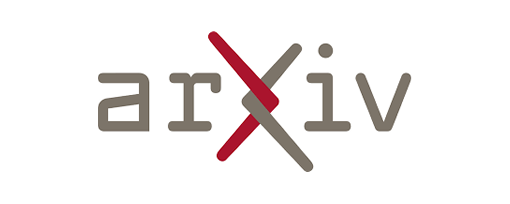

# 📰 AI & CG 每日资讯 - 2026-07-30

> 自动生成于 2026-07-30 09:09:55

## 🔥 GitHub Trending

["开源项目", "论文/研究", "大语言模型"]

GitHub

<a href="https://github.com/virgiliojr94/book-to-skill" target="_blank" class="news-title-link">
<h3 class="news-title">book-to-skill</h3>
</a>

将任何 PDF 技术书籍转化为 Claude Code 技能 — 可供您在工作时学习、参考和使用。

        
开源项目 论文/研究 大语言模型

🔤 Python
⭐ +1421

["开源项目"]

GitHub

<a href="https://github.com/pascalorg/editor" target="_blank" class="news-title-link">
<h3 class="news-title">editor</h3>
</a>

创建和共享 3D 建筑项目。

        
开源项目

🔤 TypeScript
⭐ +1022

["开源项目"]

GitHub

<a href="https://github.com/paperswithbacktest/awesome-systematic-trading" target="_blank" class="news-title-link">
<h3 class="news-title">awesome-systematic-trading</h3>
</a>

一系列很棒的库、软件包、策略、书籍、博客、系统交易教程。

        
开源项目

🔤 Python
⭐ +945

["开源项目", "论文/研究", "大语言模型"]

GitHub

<a href="https://github.com/affaan-m/ECC" target="_blank" class="news-title-link">
<h3 class="news-title">ECC</h3>
</a>

代理利用性能优化系统。 Claude Code、Codex、Open 的技能、本能、记忆、安全性和研究优先开发……

        
开源项目 论文/研究 大语言模型

🔤 JavaScript
⭐ +857

["开源项目"]

GitHub

<a href="https://github.com/huggingface/speech-to-speech" target="_blank" class="news-title-link">
<h3 class="news-title">speech-to-speech</h3>
</a>

使用开源模型构建本地语音代理

        
开源项目

🔤 Python
⭐ +827

["开源项目"]

GitHub

<a href="https://github.com/moeru-ai/airi" target="_blank" class="news-title-link">
<h3 class="news-title">airi</h3>
</a>

💖🧸 自托管，您拥有的 Grok Companion，一个 waifu 灵魂的容器，网络生活将他们带入我们的世界，...

        
开源项目

🔤 TypeScript
⭐ +682

["开源项目"]

GitHub

<a href="https://github.com/opengeos/GeoLibre" target="_blank" class="news-title-link">
<h3 class="news-title">GeoLibre</h3>
</a>

一个轻量级的云原生 GIS 平台，用于可视化、探索和分析地理空间数据。它运行在网络浏览器、桌面、...

        
开源项目

🔤 TypeScript
⭐ +671

["开源项目"]

GitHub

<a href="https://github.com/1jehuang/jcode" target="_blank" class="news-title-link">
<h3 class="news-title">jcode</h3>
</a>

RAM 效率最高的线束

        
开源项目

🔤 Rust
⭐ +640

["开源项目"]

GitHub

<a href="https://github.com/obra/superpowers" target="_blank" class="news-title-link">
<h3 class="news-title">superpowers</h3>
</a>

有效的代理技能框架和软件开发方法。

        
开源项目

🔤 Shell
⭐ +616

["开源项目", "大语言模型"]

GitHub

<a href="https://github.com/alibaba/open-code-review" target="_blank" class="news-title-link">
<h3 class="news-title">open-code-review</h3>
</a>

开源且免费——经过阿里巴巴规模的实战考验。混合架构代码审查工具：确定性管道+LLM Agent，精确的行级...

        
开源项目 大语言模型

🔤 Go
⭐ +359

## 🤗 Hugging Face Papers

> Daily Top Papers from hf.co/papers

["开源项目", "论文/研究", "机器学习"]

HuggingFace
2026-07-28T00:00:00.000Z

<a href="https://huggingface.co/papers/2607.25431" target="_blank" class="news-title-link">
<h3 class="news-title">CodeNib: A Multi-View Data System for Serving Repository Context to Coding Agents</h3>
</a>

编码代理不断地搜索、导航和保留不断发展的存储库中的上下文，但断开连接的索引、语言服务器和任务本地历史迫使重复的发现和模糊的l...

        
开源项目 论文/研究 机器学习

📄 Paper
👍 44

["论文/研究", "机器学习"]

HuggingFace
2026-07-28T00:00:00.000Z

<a href="https://huggingface.co/papers/2607.25970" target="_blank" class="news-title-link">
<h3 class="news-title">Reinforcement Learning for Code Optimization</h3>
</a>

现在已经建立了代码正确性的强化学习：让模型生成一个程序，针对隐藏的测试用例运行它，并奖励通过的解决方案。将其扩展到代码优化似乎很简单......

        
论文/研究 机器学习

📄 Paper
👍 5

["论文/研究", "机器学习"]

HuggingFace
2026-07-22T00:00:00.000Z

<a href="https://huggingface.co/papers/2607.19712" target="_blank" class="news-title-link">
<h3 class="news-title">How Fast Can Reward Models Score? A Systems Study of C++ and PyTorch Inference Runtimes for RLHF</h3>
</a>

在 RLHF 管道中，奖励评分会阻止策略更新。缓慢的评分会成为整个循环的瓶颈，因为在每次推出都获得分数之前不会运行任何更新。然而大多数设置只是默认使用 P...

        
论文/研究 机器学习

📄 Paper
👍 2

["开源项目", "论文/研究", "机器学习"]

HuggingFace
2026-07-27T00:00:00.000Z

<a href="https://huggingface.co/papers/2607.24882" target="_blank" class="news-title-link">
<h3 class="news-title">Agent Retrieval Bench: Evaluating Repository Context Retrieval for Coding Agents</h3>
</a>

现代编码代理通常通过它们最终是否生成正确的补丁来评估，但补丁的生成取决于早期的上下文获取阶段：查找存储库文件需要......

        
开源项目 论文/研究 机器学习

📄 Paper
👍 2

["论文/研究", "机器学习"]

HuggingFace
2026-07-28T00:00:00.000Z

<a href="https://huggingface.co/papers/2607.25310" target="_blank" class="news-title-link">
<h3 class="news-title">Human-in-the-Loop Signature Bootstrapping for UAV Hyperspectral PFM-1 Mine Detection</h3>
</a>

高光谱成像 (HSI) 对于材料识别很有用，但可操作的地雷筛查还取决于在发现目标之前必须检查多少次误报。本文研究...

        
论文/研究 机器学习

📄 Paper
👍 1

["机器学习", "论文/研究", "大语言模型"]

HuggingFace
2026-07-20T00:00:00.000Z

<a href="https://huggingface.co/papers/2607.17674" target="_blank" class="news-title-link">
<h3 class="news-title">Uncovering Latent Reasoning Strategies in Language Models</h3>
</a>

在推理任务上训练的语言模型 p_θ(y mid x) 学习通过多种不同的策略来解决问题，但这些策略是隐式的，并纠缠在模型的响应分布中......

        
机器学习 论文/研究 大语言模型

📄 Paper
👍 1

["论文/研究", "机器学习"]

HuggingFace
2026-07-27T00:00:00.000Z

<a href="https://huggingface.co/papers/2607.25108" target="_blank" class="news-title-link">
<h3 class="news-title">OPERA: Offline Policy-guided Expert Routing and Adaptation for Universal Biomedical Image Analysis</h3>
</a>

生物医学图像分析涵盖多种模式和任务，但现实世界的部署受到扫描仪、协议和患者群体之间严重分布变化的阻碍。高性能...

        
论文/研究 机器学习

📄 Paper
👍 0

["论文/研究", "机器学习"]

HuggingFace
2026-07-24T00:00:00.000Z

<a href="https://huggingface.co/papers/2607.22117" target="_blank" class="news-title-link">
<h3 class="news-title">Projection Pursuit CPCANet for Domain Generalization</h3>
</a>

域泛化（DG）旨在学习对分布变化具有鲁棒性的表示。最近的几何对齐方法，例如 CPCANet，通过批量 C 提取域不变结构...

        
论文/研究 机器学习

📄 Paper
👍 0

["论文/研究", "机器学习"]

HuggingFace
2026-07-14T00:00:00.000Z

<a href="https://huggingface.co/papers/2607.12544" target="_blank" class="news-title-link">
<h3 class="news-title">Edge-Aware Thermal Infrared UAV Swarm Tracking</h3>
</a>

热红外 (TIR) 成像对于视觉退化环境中的无人机群操作至关重要。然而，由于外观线索有限、频繁遮挡，跟踪微型无人机仍然具有挑战性。

        
论文/研究 机器学习

📄 Paper
👍 0

["计算机视觉", "论文/研究", "机器学习"]

HuggingFace
2026-07-27T00:00:00.000Z

<a href="https://huggingface.co/papers/2607.22135" target="_blank" class="news-title-link">
<h3 class="news-title">GLI-AL: A Multi-Modal Glioma MRI Label Resource with Unified Anatomy-Lesion Labels</h3>
</a>

现有的 BraTS-GLI 数据集为成人胶质瘤 MRI 分割提供了广泛使用的基准，但其任务定义侧重于肿瘤亚区域，并没有系统地代表共存的...

        
计算机视觉 论文/研究 机器学习

📄 Paper
👍 0

## 🚀 Product Hunt 每日精选

["产品发布"]

ProductHunt

<a href="https://www.producthunt.com/products/eqk-eq-with-ai" target="_blank" class="news-title-link">
<h3 class="news-title">EQK 3.0</h3>
</a>

具有动态 AI 均衡器的 Mac 应用

        
产品发布

🆕 Product
▲ 0

["产品发布"]

ProductHunt

<a href="https://www.producthunt.com/products/bo-ai" target="_blank" class="news-title-link">
<h3 class="news-title">Bo AI</h3>
</a>

存在于您的文本中的人工智能个人助理💬

        
产品发布

🆕 Product
▲ 0

["产品发布"]

ProductHunt

<a href="https://www.producthunt.com/products/totem-5" target="_blank" class="news-title-link">
<h3 class="news-title">Totem</h3>
</a>

您的 Twitter 书签经过整理以便您阅读

        
产品发布

🆕 Product
▲ 0

["产品发布"]

ProductHunt

<a href="https://www.producthunt.com/products/clinic-scribe-clinicframe" target="_blank" class="news-title-link">
<h3 class="news-title">ClinicFrame</h3>
</a>

就像格兰诺拉麦片一样，但用于医疗保健。完全符合 HIPAA 标准。

        
产品发布

🆕 Product
▲ 0

["产品发布"]

ProductHunt

<a href="https://www.producthunt.com/products/epilude" target="_blank" class="news-title-link">
<h3 class="news-title">Epilude</h3>
</a>

适用于 Mac 的本地语音听写，提供优美的文本

        
产品发布

🆕 Product
▲ 0

["产品发布", "大语言模型"]

ProductHunt

<a href="https://www.producthunt.com/products/spine-2" target="_blank" class="news-title-link">
<h3 class="news-title">/mission for Claude Code</h3>
</a>

给予克劳德·代码任务以产生一支特工团队

        
产品发布 大语言模型

🆕 Product
▲ 0

["产品发布", "大语言模型"]

ProductHunt

<a href="https://www.producthunt.com/products/blackflare" target="_blank" class="news-title-link">
<h3 class="news-title">BlackFlare</h3>
</a>

菜单栏中 Claude Code 和 Codex 的任务控制

        
产品发布 大语言模型

🆕 Product
▲ 0

["产品发布"]

ProductHunt

<a href="https://www.producthunt.com/products/denovo-business-manager" target="_blank" class="news-title-link">
<h3 class="news-title">Denovo</h3>
</a>

将您的氛围编码应用程序转变为付费客户

        
产品发布

🆕 Product
▲ 0

["实时渲染", "产品发布"]

ProductHunt

<a href="https://www.producthunt.com/products/soundgate-guitar-app" target="_blank" class="news-title-link">
<h3 class="news-title">SoundGate Guitar</h3>
</a>

AI 音乐导师可为您的演奏提供实时反馈

        
实时渲染 产品发布

🆕 Product
▲ 0

["产品发布"]

ProductHunt

<a href="https://www.producthunt.com/products/prelint" target="_blank" class="news-title-link">
<h3 class="news-title">Prelint</h3>
</a>

防止人工智能编写的代码中的产品偏差

        
产品发布

🆕 Product
▲ 0

## 🎨 CG 图形学

> 覆盖: Unreal Engine | Three.js | Blender | Houdini | Unity | Godot | NVIDIA

["官方资讯"]

Official
Tue, 21 Jul 2026 00:00:00 GMT

<a href="https://www.unrealengine.com/news/the-fab-summer-mega-sale-is-now-on" target="_blank" class="news-title-link">
<h3 class="news-title">The Fab Summer Mega Sale is now on!</h3>
</a>

Fab 夏季特卖现已开始！

        
官方资讯

🏛️ 官方 🤖 AI
🔥 100

["Unity", "官方资讯"]

Official
Mon, 20 Jul 2026 00:00:00 GMT

<a href="https://unity.com/blog/meet-the-unity-cli" target="_blank" class="news-title-link">
<h3 class="news-title">Meet the Unity CLI: manage Unity from your terminal</h3>
</a>

了解 Unity CLI：从终端管理 Unity

        
Unity 官方资讯

🏛️ 官方 🤖 AI
🔥 100

["官方资讯"]

Official
Tue, 14 Jul 2026 12:00:00 +0000

<a href="https://godotengine.org/article/maintenance-release-godot-4-7-1/" target="_blank" class="news-title-link">
<h3 class="news-title">Maintenance release: Godot 4.7.1</h3>
</a>

维护版本：Godot 4.7.1

        
官方资讯

🏛️ 官方 🤖 AI
🔥 100

["官方资讯"]

Official
2026-07-29T16:46:45Z

<a href="https://developer.nvidia.com/blog/how-to-self-host-a-validated-ai-coding-assistant-with-nvidia-nemo-guardrails/" target="_blank" class="news-title-link">
<h3 class="news-title">How to Self-Host a Validated AI Coding Assistant with NVIDIA NeMo Guardrails</h3>
</a>

如何使用 NVIDIA NeMo Guardrails 自行托管经过验证的 AI 编码助手

        
官方资讯

🏛️ 官方 🤖 AI
🔥 100

["官方资讯"]

Official
Fri, 26 Jun 2026 00:00:00 GMT

<a href="https://www.unrealengine.com/learning/junes-epic-learning-content-metahumans-mesh-terrain-and-more" target="_blank" class="news-title-link">
<h3 class="news-title">June’s Epic learning content: MetaHumans, Mesh Terrain, and more</h3>
</a>

六月的史诗级学习内容：MetaHumans、Mesh Terrain 等

        
官方资讯

🏛️ 官方 🤖 AI
🔥 100

["Unreal Engine", "官方资讯"]

Official
Wed, 24 Jun 2026 00:00:00 GMT

<a href="https://www.unrealengine.com/spotlights/shining-isle-productions-goes-all-in-on-unreal-engine-for-the-wingfeather-saga" target="_blank" class="news-title-link">
<h3 class="news-title">Shining Isle Productions goes all-in on Unreal Engine for The Wingfeather Saga</h3>
</a>

Shining Isle Productions 全力打造《Wingfeather Saga》的虚幻引擎

        
Unreal Engine 官方资讯

🏛️ 官方 🤖 AI
🔥 100

["Unreal Engine", "官方资讯"]

Official
Tue, 23 Jun 2026 00:00:00 GMT

<a href="https://www.unrealengine.com/news/unreal-engine-5-8-is-now-available" target="_blank" class="news-title-link">
<h3 class="news-title">Unreal Engine 5.8 is now available</h3>
</a>

虚幻引擎 5.8 现已推出

        
Unreal Engine 官方资讯

🏛️ 官方 🤖 AI
🔥 100

["Unity", "官方资讯"]

Official
Thu, 25 Jun 2026 00:00:00 GMT

<a href="https://unity.com/blog/d7-vs-d28-iap-roas-campaigns" target="_blank" class="news-title-link">
<h3 class="news-title">D7 or D28 IAP ROAS campaigns? The answer is both</h3>
</a>

D7 或 D28 IAP ROAS 广告系列？答案是两者都有

        
Unity 官方资讯

🏛️ 官方 🤖 AI
🔥 100

["官方资讯"]

Official
2026-07-27T09:00:00Z

<a href="https://developer.nvidia.com/blog/six-agent-harness-capabilities-for-higher-model-performance/" target="_blank" class="news-title-link">
<h3 class="news-title">Six Agent Harness Capabilities for Higher Model Performance</h3>
</a>

六种代理利用功能提高模型性能

        
官方资讯

🏛️ 官方 🤖 AI
🔥 100

["官方资讯", "Blender"]

Official
Tue, 14 Jul 2026 15:48:17 +0000

<a href="https://www.blender.org/press/blender-5-2-lts-release/" target="_blank" class="news-title-link">
<h3 class="news-title">Blender 5.2 LTS Release</h3>
</a>

Blender 5.2 LTS 版本

        
官方资讯 Blender

🏛️ 官方
🔥 50

["开源项目", "Three.js", "官方资讯"]

Official
2026-07-01T23:22:26Z

<a href="https://github.com/mrdoob/three.js/releases/tag/r185" target="_blank" class="news-title-link">
<h3 class="news-title">r185</h3>
</a>

r185

        
开源项目 Three.js 官方资讯

🏛️ 官方
🔥 50

["Unreal Engine", "官方资讯"]

Official
Thu, 23 Jul 2026 00:00:00 GMT

<a href="https://www.unrealengine.com/events/south-east-asia-dev-days" target="_blank" class="news-title-link">
<h3 class="news-title">South East Asia Dev Days | Unreal Engine</h3>
</a>

东南亚开发日 |虚幻引擎

        
Unreal Engine 官方资讯

🏛️ 官方
🔥 50

["官方资讯", "Blender"]

Official
Wed, 08 Jul 2026 10:01:24 +0000

<a href="https://www.blender.org/events/blender-at-siggraph-2026/" target="_blank" class="news-title-link">
<h3 class="news-title">Blender at SIGGRAPH 2026</h3>
</a>

SIGGRAPH 2026 上的 Blender

        
官方资讯 Blender

🏛️ 官方
🔥 50

["官方资讯", "Blender"]

Official
Fri, 03 Jul 2026 10:17:54 +0000

<a href="https://www.blender.org/events/blender-in-annecy-2026-recap/" target="_blank" class="news-title-link">
<h3 class="news-title">Blender in Annecy 2026 Recap</h3>
</a>

安纳西搅拌机 2026 年回顾

        
官方资讯 Blender

🏛️ 官方
🔥 50

["Unity", "官方资讯", "Blender"]

Official
Tue, 02 Jun 2026 13:25:00 +0000

<a href="https://www.blender.org/events/blender-in-annecy-2026/" target="_blank" class="news-title-link">
<h3 class="news-title">Blender in Annecy 2026</h3>
</a>

2026 年安纳西搅拌机

        
Unity 官方资讯 Blender

🏛️ 官方
🔥 50

## 💬 Hacker News 热议

["行业动态", "论文/研究"]

HackerNews

<a href="https://www.science.org/content/article/ai-s-top-startups-are-barely-publishing-their-research" target="_blank" class="news-title-link">
<h3 class="news-title">AI's top startups are barely publishing their research</h3>
</a>

人工智能的顶级初创公司几乎没有发表他们的研究成果

        
行业动态 论文/研究

💬 97 评论
Points: 175

["行业动态"]

HackerNews

<a href="https://zachholman.com/posts/cold-email" target="_blank" class="news-title-link">
<h3 class="news-title">The Cold Email</h3>
</a>

冰冷的电子邮件

        
行业动态

💬 34 评论
Points: 77

["行业动态"]

HackerNews

<a href="https://enklypesalt.com/posts/context-collapse-part3-ai-worming-through-word/" target="_blank" class="news-title-link">
<h3 class="news-title">Document-borne AI worms can self-propagate through Copilot for Word</h3>
</a>

文档传播的 AI 蠕虫可以通过 Copilot for Word 自我传播

        
行业动态

💬 258 评论
Points: 340

["行业动态"]

HackerNews

<a href="https://www.emergingtrajectories.com/lh/commodification-and-circularity/" target="_blank" class="news-title-link">
<h3 class="news-title">Commodification of Intelligence: Good, Bad, and Ugly Circular AI Deals</h3>
</a>

情报商品化：好的、坏的和丑陋的循环人工智能交易

        
行业动态

💬 28 评论
Points: 55

["行业动态"]

HackerNews

<a href="https://www.newscientist.com/article/2580119-hunter-gatherers-introduced-fish-to-a-mountain-lake-7000-years-ago/" target="_blank" class="news-title-link">
<h3 class="news-title">Hunter-gatherers introduced fish to a mountain lake 7000 years ago</h3>
</a>

7000 年前，狩猎采集者将鱼类引入山间湖泊

        
行业动态

💬 105 评论
Points: 141

["行业动态", "大语言模型"]

HackerNews

<a href="https://juliahub.com/blog/frontier-models-physical-ai-evaluation" target="_blank" class="news-title-link">
<h3 class="news-title">GPT-5.6 vs. Claude Fable 5 for Physical AI, which performs best?</h3>
</a>

GPT-5.6 与物理 AI 的克劳德寓言 5，哪个表现最好？

        
行业动态 大语言模型

💬 18 评论
Points: 85

["行业动态"]

HackerNews

<a href="https://amiga.lychesis.net/index.html" target="_blank" class="news-title-link">
<h3 class="news-title">Amiga Graphics Archive</h3>
</a>

Amiga 图形档案

        
行业动态

💬 24 评论
Points: 152

["开源项目", "行业动态"]

HackerNews

<a href="https://github.blog/security/supply-chain-security/disrupting-supply-chain-attacks-on-npm-and-github-actions/" target="_blank" class="news-title-link">
<h3 class="news-title">Disrupting supply chain attacks on NPM and GitHub Actions</h3>
</a>

针对 NPM 和 GitHub Actions 的中断供应链攻击

        
开源项目 行业动态

💬 34 评论
Points: 85

["行业动态"]

HackerNews

<a href="https://tailscale.com/blog/jailbroken-kindle-proxy-tun-modes" target="_blank" class="news-title-link">
<h3 class="news-title">More Tailscale tricks for your jailbroken Kindle</h3>
</a>

适用于越狱 Kindle 的更多 Tailscale 技巧

        
行业动态

💬 108 评论
Points: 387

["行业动态"]

HackerNews

<a href="https://potsandpansbyccg.com/2026/07/29/after-the-ai-crash/" target="_blank" class="news-title-link">
<h3 class="news-title">After the AI Crash</h3>
</a>

人工智能崩溃之后

        
行业动态

💬 187 评论
Points: 109

## 🎓 学术前沿 (arXiv)

["论文/研究", "大语言模型"]

arXiv
2026-07-28T17:27:49Z

<a href="https://arxiv.org/pdf/2607.26016v1" target="_blank" class="news-title-link">
<h3 class="news-title">MDTransformer: A Hardware-Software Co-Design of Mode-Division Photonic Transformer Accelerator with Inverse-Designed Coherent Crossbar</h3>
</a>

MDTransformer：具有逆向设计相干交叉开关的模分光子变压器加速器的软硬件协同设计

        
论文/研究 大语言模型

✍️ Mahmoud Rasras
📄 PDF

["论文/研究"]

arXiv
Wed, 29 Jul 2026 00:00:00 -0400

<a href="https://arxiv.org/abs/2508.05899" target="_blank" class="news-title-link">
<h3 class="news-title">HOLODECK 2.0: Vision-Language-Guided 3D World Generation with Editing</h3>
</a>

HOLODECK 2.0：视觉语言引导的 3D 世界生成与编辑

        
论文/研究

✍️ Zixuan Bian, Ruohan Ren, Yue Y...
📄 PDF

["实时渲染", "论文/研究", "NeRF/3DGS"]

arXiv
Wed, 29 Jul 2026 00:00:00 -0400

<a href="https://arxiv.org/abs/2602.18314" target="_blank" class="news-title-link">
<h3 class="news-title">Diff2DGS: Reliable Reconstruction of Occluded Surgical Scenes via 2D Gaussian Splatting</h3>
</a>

Diff2DGS：通过 2D 高斯溅射可靠地重建被遮挡的手术场景

        
实时渲染 论文/研究 NeRF/3DGS

✍️ Tianyi Song, Danail Stoyanov, ...
📄 PDF

["计算机视觉", "论文/研究"]

arXiv
2026-07-28T16:45:52Z

<a href="https://arxiv.org/pdf/2607.25962v1" target="_blank" class="news-title-link">
<h3 class="news-title">LaP-Forensics: Latent-Pixel Consistency Guided Multimodal Reasoning for Deepfake Detection</h3>
</a>

LaP-Forensics：用于 Deepfake 检测的潜在像素一致性引导多模态推理

        
计算机视觉 论文/研究

✍️ Fei Shen
📄 PDF

["实时渲染", "论文/研究"]

arXiv
2026-07-28T17:59:31Z

<a href="https://arxiv.org/pdf/2607.26055v1" target="_blank" class="news-title-link">
<h3 class="news-title">$π\mathbf{R}^2$: Reactive Real-time Flow Policies</h3>
</a>

$π\mathbf{R}^2$：反应式实时流策略

        
实时渲染 论文/研究

✍️ Shubham Tulsiani
📄 PDF

["论文/研究", "大语言模型"]

arXiv
2026-07-28T17:12:12Z

<a href="https://arxiv.org/pdf/2607.25995v1" target="_blank" class="news-title-link">
<h3 class="news-title">Does Runtime Topology Context Improve LLM-Generated Kubernetes Security Patches?</h3>
</a>

运行时拓扑上下文是否可以改进 LLM 生成的 Kubernetes 安全补丁？

        
论文/研究 大语言模型

✍️ Farooq Shaikh
📄 PDF

["论文/研究", "大语言模型"]

arXiv
Wed, 29 Jul 2026 00:00:00 -0400

<a href="https://arxiv.org/abs/2607.25140" target="_blank" class="news-title-link">
<h3 class="news-title">How Affect Propagates among LLM Agents: Emergent Emotional Contagion in Crowd Simulation</h3>
</a>

影响力如何在法学硕士代理人之间传播：人群模拟中的突发情绪传染

        
论文/研究 大语言模型

✍️ Funda Durupinar
📄 PDF

["论文/研究", "NeRF/3DGS"]

arXiv
Wed, 29 Jul 2026 00:00:00 -0400

<a href="https://arxiv.org/abs/2607.25377" target="_blank" class="news-title-link">
<h3 class="news-title">Gaussian Volumetric Representation for Efficient Shear-Warp Visualization</h3>
</a>

用于高效剪切扭曲可视化的高斯体积表示

        
论文/研究 NeRF/3DGS

✍️ Mayuri Mathur (Indraprastha In...
📄 PDF

["计算机视觉", "论文/研究"]

arXiv
2026-07-28T17:50:25Z

<a href="https://arxiv.org/pdf/2607.26042v1" target="_blank" class="news-title-link">
<h3 class="news-title">VetClaw: An Edge-Cloud Multimodal Agentic System for Veterinary Disease Screening</h3>
</a>

VetClaw：用于兽医疾病筛查的边缘云多模式代理系统

        
计算机视觉 论文/研究

✍️ Abdur R. Shahid
📄 PDF

["计算机视觉", "论文/研究", "图像生成"]

arXiv
2026-07-28T17:20:00Z

<a href="https://arxiv.org/pdf/2607.26004v1" target="_blank" class="news-title-link">
<h3 class="news-title">Parallel Decoding Distillation for Fast Image and Video Generation</h3>
</a>

用于快速图像和视频生成的并行解码蒸馏

        
计算机视觉 论文/研究 图像生成

✍️ Julius Berner
📄 PDF

---