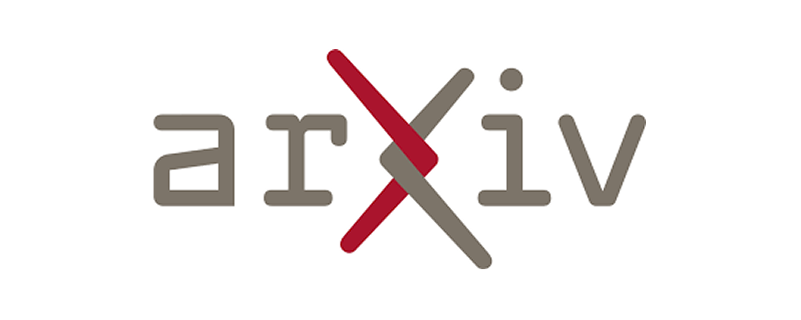

# 📰 AI & CG 每日资讯 - 2026-09-28

> 自动生成于 2026-09-28 10:05:40

## 🔥 GitHub Trending

["开源项目"]

GitHub

<a href="https://github.com/vectorize-io/hindsight" target="_blank" class="news-title-link">
<h3 class="news-title">hindsight</h3>
</a>

事后诸葛亮：智能体的学习记忆

        
开源项目

🔤 Python
⭐ +4520

["开源项目"]

GitHub

<a href="https://github.com/debpalash/VoiceStudio" target="_blank" class="news-title-link">
<h3 class="news-title">VoiceStudio</h3>
</a>

VoiceStudio 是开源、完全本地化的 ElevenLabs 替代方案 — 语音克隆、语音设计、视频配音、听...

        
开源项目

🔤 Python
⭐ +3086

["开源项目", "论文/研究"]

GitHub

<a href="https://github.com/paperclipai/paperclip" target="_blank" class="news-title-link">
<h3 class="news-title">paperclip</h3>
</a>

每个人都用它来管理工作中的座席的开源应用程序

        
开源项目 论文/研究

🔤 TypeScript
⭐ +2401

["开源项目"]

GitHub

<a href="https://github.com/dream-num/univer" target="_blank" class="news-title-link">
<h3 class="news-title">univer</h3>
</a>

AI 代理的 Office 工具 — 在一个运行时中处理电子表格、文档、幻灯片、画布、关系表和 PDF。

        
开源项目

🔤 TypeScript
⭐ +895

["开源项目"]

GitHub

<a href="https://github.com/rohitg00/ai-engineering-from-scratch" target="_blank" class="news-title-link">
<h3 class="news-title">ai-engineering-from-scratch</h3>
</a>

学习它。建造它。寄给别人。

        
开源项目

🔤 Python
⭐ +790

["开源项目"]

GitHub

<a href="https://github.com/InfinityLoop1308/PipePipe" target="_blank" class="news-title-link">
<h3 class="news-title">PipePipe</h3>
</a>

一款开源 Android 应用程序，可让您自由浏览 YouTube 和其他服务。

        
开源项目

🔤 Shell
⭐ +242

["开源项目", "大语言模型"]

GitHub

<a href="https://github.com/mvschwarz/openrig" target="_blank" class="news-title-link">
<h3 class="news-title">openrig</h3>
</a>

将 Claude Code 和 Codex 作为一个系统一起运行的多代理工具

        
开源项目 大语言模型

🔤 TypeScript
⭐ +114

["开源项目"]

GitHub

<a href="https://github.com/vercel-labs/scriptc" target="_blank" class="news-title-link">
<h3 class="news-title">scriptc</h3>
</a>

TypeScript 到 Native 编译器

        
开源项目

🔤 TypeScript
⭐ +102

["开源项目"]

GitHub

<a href="https://github.com/willfaust/Madeira" target="_blank" class="news-title-link">
<h3 class="news-title">Madeira</h3>
</a>

通过 FEX-Emu + Wine + DXMT 在被监禁的 iOS 上运行 x86-64 Windows PC 游戏

        
开源项目

🔤 C
⭐ +83

## 🤗 Hugging Face Papers

> Daily Top Papers from hf.co/papers

["机器学习", "大语言模型", "论文/研究"]

HuggingFace
2026-09-24T00:00:00.000Z

<a href="https://huggingface.co/papers/2609.29845" target="_blank" class="news-title-link">
<h3 class="news-title">Your Transformer Can Hold Two Thoughts at Once: Evidence of Linear Superposition in LLMs</h3>
</a>

虽然大型语言模型 (LLM) 依赖于高度非线性的组件，但在这项工作中，我们证明它们表现出基本的线性性：当来自不同文本流的输入线性组合时...

        
机器学习 大语言模型 论文/研究

📄 Paper
👍 75

["机器学习", "大语言模型", "论文/研究"]

HuggingFace
2026-09-23T00:00:00.000Z

<a href="https://huggingface.co/papers/2609.28603" target="_blank" class="news-title-link">
<h3 class="news-title">Learning to Discover Interesting Mathematics</h3>
</a>

最近，大型语言模型（LLM）越来越能够解决高级数学问题，包括许多已经开放了几十年的问题。这为数学的扩展打开了大门...

        
机器学习 大语言模型 论文/研究

📄 Paper
👍 11

["机器学习", "论文/研究"]

HuggingFace
2026-09-24T00:00:00.000Z

<a href="https://huggingface.co/papers/2609.30233" target="_blank" class="news-title-link">
<h3 class="news-title">Coding Agents for Generalized Task and Motion Planning Problems</h3>
</a>

即使具有完全可观测性和以对象为中心的状态，任务和运动规划 (TAMP) 问题仍然很困难，因为离散决策与几何、运动学和动态紧密耦合......

        
机器学习 论文/研究

📄 Paper
👍 11

["机器学习", "大语言模型", "论文/研究"]

HuggingFace
2026-09-24T00:00:00.000Z

<a href="https://huggingface.co/papers/2609.29362" target="_blank" class="news-title-link">
<h3 class="news-title">Parts-of-Speech as Emergent Categories in SAE Latent Space</h3>
</a>

稀疏自动编码器（SAE）提供了一种有前途的方法来检查语言模型表示，但仍不清楚它们的潜伏暴露了什么样的语言结构。我们使用词性（Po...

        
机器学习 大语言模型 论文/研究

📄 Paper
👍 10

["机器学习", "计算机视觉", "论文/研究"]

HuggingFace
2026-09-24T00:00:00.000Z

<a href="https://huggingface.co/papers/2609.29028" target="_blank" class="news-title-link">
<h3 class="news-title">RGBD20K: A Large-Scale Benchmark for RGB-D Semantic Segmentation</h3>
</a>

在本文中，我们提出了 RGBD20K，这是一个新颖的数据集，通过包含丰富的类别和高质量的注释来促进更强大和更通用的 RGB-D 语义分割的开发...

        
机器学习 计算机视觉 论文/研究

📄 Paper
👍 8

["机器学习", "大语言模型", "论文/研究"]

HuggingFace
2026-09-24T00:00:00.000Z

<a href="https://huggingface.co/papers/2609.29429" target="_blank" class="news-title-link">
<h3 class="news-title">Just Ask Jev: Reinforcement Learning for Calibrated Decisions as a Zero-Shot Detector of AI Alignment Failures</h3>
</a>

对齐失败检测器会筛选已部署的语言模型并对对齐基准进行评分。大多数是生成法官，他们对每个标准都进行解码，而分类器则读取...

        
机器学习 大语言模型 论文/研究

📄 Paper
👍 7

["机器学习", "图像生成", "论文/研究"]

HuggingFace
2026-09-25T00:00:00.000Z

<a href="https://huggingface.co/papers/2609.31620" target="_blank" class="news-title-link">
<h3 class="news-title">FuseReg: Regularizing Layer Fusion Mitigates the Reconstruction-Generation Gap in Representation Autoencoders</h3>
</a>

表示自动编码器 (RAE) 重用预训练视觉编码器的特征作为重建和扩散潜伏，将强大的视觉表示集成到图像生成中。然而，...

        
机器学习 图像生成 论文/研究

📄 Paper
👍 5

["机器学习", "图像生成", "论文/研究"]

HuggingFace
2026-09-24T00:00:00.000Z

<a href="https://huggingface.co/papers/2609.29816" target="_blank" class="news-title-link">
<h3 class="news-title">AV-GRPO: Modality-Anchored Decoupling Diffusion Reinforcement Learning for Joint Audio-Video Generation</h3>
</a>

近年来，音视频联合生成取得了重大进展。现有模型仍然存在有限的模态保真度、文本模态对齐不足以及跨模态能力弱等问题。

        
机器学习 图像生成 论文/研究

📄 Paper
👍 5

["机器学习", "论文/研究"]

HuggingFace
2026-09-23T00:00:00.000Z

<a href="https://huggingface.co/papers/2609.28811" target="_blank" class="news-title-link">
<h3 class="news-title">DeltaWAM: Delta World Action Models for Bimanual Manipulation</h3>
</a>

世界动作模型（WAM）通过联合建模视觉动态和动作，将视觉和运动先验从预训练的视频生成器传输到机器人控制。然而，现有的 WAM 预测密集......

        
机器学习 论文/研究

📄 Paper
👍 4

["机器学习", "论文/研究"]

HuggingFace
2026-09-23T00:00:00.000Z

<a href="https://huggingface.co/papers/2609.28660" target="_blank" class="news-title-link">
<h3 class="news-title">Morphometric Imitation: From Morphology and Contact Aware Hand Retargeting to Sim-to-Real Visuomotor Policy</h3>
</a>

人手与物体交互（HOI）为灵巧操作提供了丰富的演示来源，但直接从中学习在弥合形态差距、确保...

        
机器学习 论文/研究

📄 Paper
👍 0

## 🚀 Product Hunt 每日精选

["产品发布"]

ProductHunt

<a href="https://www.producthunt.com/products/kiwidesk" target="_blank" class="news-title-link">
<h3 class="news-title">KiwiDesk</h3>
</a>

平铺感觉就像 macOS 附带的一样。

        
产品发布

🆕 Product
▲ 0

["产品发布"]

ProductHunt

<a href="https://www.producthunt.com/products/superhuman-go" target="_blank" class="news-title-link">
<h3 class="news-title">Superhuman Go</h3>
</a>

随时随地工作的人工智能助手

        
产品发布

🆕 Product
▲ 0

["产品发布"]

ProductHunt

<a href="https://www.producthunt.com/products/harmony-it" target="_blank" class="news-title-link">
<h3 class="news-title">Harmony</h3>
</a>

解决 Slack 和 Teams 内 IT/HR 问题的 AI 代理

        
产品发布

🆕 Product
▲ 0

["大语言模型", "产品发布"]

ProductHunt

<a href="https://www.producthunt.com/products/cuey-2" target="_blank" class="news-title-link">
<h3 class="news-title">Cuey</h3>
</a>

在一个选项卡中比较 ChatGPT、Claude 和 Gemini 的答案。

        
大语言模型 产品发布

🆕 Product
▲ 0

["大语言模型", "产品发布"]

ProductHunt

<a href="https://www.producthunt.com/products/openai" target="_blank" class="news-title-link">
<h3 class="news-title">GPT-6 Sol & Luna</h3>
</a>

前沿AI智能，现半价

        
大语言模型 产品发布

🆕 Product
▲ 0

["产品发布"]

ProductHunt

<a href="https://www.producthunt.com/products/clicks" target="_blank" class="news-title-link">
<h3 class="news-title">Clicks Communicator</h3>
</a>

一种专为做事而设计的新型移动通信器

        
产品发布

🆕 Product
▲ 0

["产品发布"]

ProductHunt

<a href="https://www.producthunt.com/products/humalike-2" target="_blank" class="news-title-link">
<h3 class="news-title">Humalike x GTA RP</h3>
</a>

能够自己说话、记忆和行动的 AI NPC

        
产品发布

🆕 Product
▲ 0

["大语言模型", "产品发布"]

ProductHunt

<a href="https://www.producthunt.com/products/chit-2" target="_blank" class="news-title-link">
<h3 class="news-title">Chit</h3>
</a>

克劳德代码打印的一天收据

        
大语言模型 产品发布

🆕 Product
▲ 0

["产品发布"]

ProductHunt

<a href="https://www.producthunt.com/products/makermap" target="_blank" class="news-title-link">
<h3 class="news-title">MakerMap</h3>
</a>

创客及其正在建造的产品的动态地图

        
产品发布

🆕 Product
▲ 0

["产品发布"]

ProductHunt

<a href="https://www.producthunt.com/products/goodsocials" target="_blank" class="news-title-link">
<h3 class="news-title">GoodSocials</h3>
</a>

LinkedIn 的人工智能社交媒体经理。只做真实内容

        
产品发布

🆕 Product
▲ 0

## 🎨 CG 图形学

> 覆盖: Unreal Engine | Three.js | Blender | Houdini | Unity | Godot | NVIDIA

["官方资讯"]

Official
Fri, 28 Aug 2026 00:00:00 GMT

<a href="https://www.unrealengine.com/learning/augusts-epic-learning-content-networked-physics-dynamic-audio-and-more" target="_blank" class="news-title-link">
<h3 class="news-title">August’s Epic learning content: Networked physics, dynamic audio, and more</h3>
</a>

八月的史诗学习内容：网络物理、动态音频等等

        
官方资讯

🏛️ 官方 🤖 AI
🔥 100

["开源项目", "官方资讯", "Blender"]

Official
Wed, 23 Sep 2026 07:39:43 +0000

<a href="https://www.blender.org/news/blender-foundation-annual-report-2025/" target="_blank" class="news-title-link">
<h3 class="news-title">Blender Foundation Annual Report 2025</h3>
</a>

Blender 基金会 2025 年年度报告

        
开源项目 官方资讯 Blender

🏛️ 官方 🤖 AI
🔥 100

["官方资讯", "Unity"]

Official
Tue, 22 Sep 2026 00:00:00 GMT

<a href="https://unity.com/blog/unity-simulation-pro-early-access" target="_blank" class="news-title-link">
<h3 class="news-title">From simulation to real-world deployment: Unity Simulation Pro early access</h3>
</a>

从模拟到实际部署：Unity Simulation Pro 抢先体验

        
官方资讯 Unity

🏛️ 官方 🤖 AI
🔥 100

["官方资讯"]

Official
Thu, 10 Sep 2026 12:00:00 +0000

<a href="https://godotengine.org/article/dev-snapshot-godot-4-8-dev-5/" target="_blank" class="news-title-link">
<h3 class="news-title">Dev snapshot: Godot 4.8 dev 5</h3>
</a>

开发快照：Godot 4.8 dev 5

        
官方资讯

🏛️ 官方 🤖 AI
🔥 100

["官方资讯"]

Official
2026-09-28T01:00:00Z

<a href="https://developer.nvidia.com/blog/how-nvidia-dsx-maxlps-maximizes-ai-factory-throughput-and-efficiency/" target="_blank" class="news-title-link">
<h3 class="news-title">How NVIDIA DSX MaxLPS Maximizes AI Factory Throughput and Efficiency</h3>
</a>

NVIDIA DSX MaxLPS 如何最大限度地提高 AI 工厂吞吐量和效率

        
官方资讯

🏛️ 官方 🤖 AI
🔥 100

["官方资讯", "大语言模型"]

Official
2026-09-24T15:00:00Z

<a href="https://developer.nvidia.com/blog/efficient-moe-training-for-biological-foundation-models/" target="_blank" class="news-title-link">
<h3 class="news-title">Efficient MoE Training for Biological Foundation Models</h3>
</a>

生物基础模型的高效 MoE 培训

        
官方资讯 大语言模型

🏛️ 官方 🤖 AI
🔥 100

["官方资讯"]

Official
2026-09-23T22:54:56Z

<a href="https://developer.nvidia.com/blog/introducing-nv-reason-ct-open-3d-ct-vlm-for-radiologist-chain-of-thought-reasoning/" target="_blank" class="news-title-link">
<h3 class="news-title">Introducing NV-Reason-CT Open 3D CT VLM for Radiologist Chain-of-Thought Reasoning</h3>
</a>

为放射科医生推出 NV-Reason-CT 开放式 3D CT VLM 思维链推理

        
官方资讯

🏛️ 官方 🤖 AI
🔥 100

["开源项目", "官方资讯"]

Official
2026-09-23T19:45:19Z

<a href="https://developer.nvidia.com/blog/validate-gpu-cluster-readiness-before-ai-workloads-land/" target="_blank" class="news-title-link">
<h3 class="news-title">Validate GPU Cluster Readiness Before AI Workloads Land</h3>
</a>

在 AI 工作负载落地之前验证 GPU 集群准备情况

        
开源项目 官方资讯

🏛️ 官方 🤖 AI
🔥 100

["开源项目", "Three.js", "官方资讯"]

Official
2026-09-24T14:35:44Z

<a href="https://github.com/mrdoob/three.js/releases/tag/r186" target="_blank" class="news-title-link">
<h3 class="news-title">r186</h3>
</a>

r186

        
开源项目 Three.js 官方资讯

🏛️ 官方
🔥 50

["官方资讯", "Unreal Engine"]

Official
Mon, 21 Sep 2026 00:00:00 GMT

<a href="https://www.unrealengine.com/developer-interviews/tt-games-brings-gotham-city-to-life-in-lego-batman-legacy-of-the-dark-knight" target="_blank" class="news-title-link">
<h3 class="news-title">TT Games brings Gotham City to life in LEGO Batman: Legacy of the Dark Knight</h3>
</a>

TT Games 在乐高蝙蝠侠：黑暗骑士的遗产中将哥谭市带入生活

        
官方资讯 Unreal Engine

🏛️ 官方
🔥 50

["官方资讯", "Unreal Engine"]

Official
Thu, 03 Sep 2026 00:00:00 GMT

<a href="https://www.unrealengine.com/tech-blog/stepping-inside-a-retro-anime-inspired-game-a-look-into-the-rendering-of-orbitals" target="_blank" class="news-title-link">
<h3 class="news-title">Stepping inside a retro anime-inspired game: a look into the rendering of Orbitals</h3>
</a>

走进复古动漫风格的游戏：观察 Orbitals 的渲染

        
官方资讯 Unreal Engine

🏛️ 官方
🔥 50

["官方资讯", "Unreal Engine"]

Official
Thu, 03 Sep 2026 00:00:00 GMT

<a href="https://www.unrealengine.com/events/emea-dev-days" target="_blank" class="news-title-link">
<h3 class="news-title">EMEA Dev Days | Unreal Engine</h3>
</a>

欧洲、中东和非洲开发日 |虚幻引擎

        
官方资讯 Unreal Engine

🏛️ 官方
🔥 50

["官方资讯", "Unreal Engine"]

Official
Wed, 02 Sep 2026 00:00:00 GMT

<a href="https://www.unrealengine.com/developer-interviews/heres-why-rebel-wolves-chose-ue5-to-power-its-ambitious-large-scale-open-world-rpg-the-blood-of-dawnwalker" target="_blank" class="news-title-link">
<h3 class="news-title">Here’s why Rebel Wolves chose UE5 to power its ambitious, large scale, open world RPG The Blood of Dawnwalker</h3>
</a>

这就是 Rebel Wolves 选择 UE5 为其雄心勃勃的大型开放世界角色扮演游戏《黎明行者之血》提供支持的原因

        
官方资讯 Unreal Engine

🏛️ 官方
🔥 50

["Unity", "官方资讯", "Blender"]

Official
Fri, 25 Sep 2026 16:46:28 +0000

<a href="https://www.blender.org/press/20-years-open-movies/" target="_blank" class="news-title-link">
<h3 class="news-title">Celebrating 20 Years of Open Movies</h3>
</a>

庆祝电影开放 20 周年

        
Unity 官方资讯 Blender

🏛️ 官方
🔥 50

["官方资讯", "Blender"]

Official
Mon, 21 Sep 2026 10:58:44 +0000

<a href="https://www.blender.org/news/show-your-support-for-blender-projects/" target="_blank" class="news-title-link">
<h3 class="news-title">Show your support for Blender projects</h3>
</a>

表达您对 Blender 项目的支持

        
官方资讯 Blender

🏛️ 官方
🔥 50

## 💬 Hacker News 热议

["行业动态"]

HackerNews

<a href="https://tinyaiarena.com/" target="_blank" class="news-title-link">
<h3 class="news-title">Show HN: TinyAIArena watch AI agents battle it out</h3>
</a>

Show HN：TinyAIArena 观看 AI 代理决一胜负

        
行业动态

💬 40 评论
Points: 99

["行业动态"]

HackerNews

<a href="https://www.ihatethefuture.com/2026/09/the-normalization-of-inexplicable.html" target="_blank" class="news-title-link">
<h3 class="news-title">The Normalization of Inexplicable Failures</h3>
</a>

无法解释的故障的正常化

        
行业动态

💬 103 评论
Points: 247

["行业动态"]

HackerNews

<a href="https://www.movingimagearchive.com/" target="_blank" class="news-title-link">
<h3 class="news-title">A searchable library of forgotten public-domain film clips from 1915 onward</h3>
</a>

可搜索的 1915 年以来被遗忘的公共领域电影片段库

        
行业动态

💬 27 评论
Points: 209

["行业动态"]

HackerNews

<a href="https://eoinhiggins.substack.com/p/there-are-no-rogue-ai-agents" target="_blank" class="news-title-link">
<h3 class="news-title">There are no "rogue" AI agents</h3>
</a>

不存在“流氓”人工智能代理

        
行业动态

💬 246 评论
Points: 337

["行业动态"]

HackerNews

<a href="https://authorsguild.org/news/ag-v-openai-top-execs-knew-mass-book-piracy-was-illegal/" target="_blank" class="news-title-link">
<h3 class="news-title">Unsealed Briefs in Authors’ Case v. Microsoft/OpenAI</h3>
</a>

作者诉微软/OpenAI 案中未密封的内情

        
行业动态

💬 586 评论
Points: 601

["行业动态", "大语言模型"]

HackerNews

<a href="https://ampdot.mesh.host/token-space-fonts.html" target="_blank" class="news-title-link">
<h3 class="news-title">Generate fonts where every LLM token is the same width</h3>
</a>

生成每个 LLM 令牌宽度相同的字体

        
行业动态 大语言模型

💬 23 评论
Points: 87

["行业动态", "大语言模型"]

HackerNews

<a href="https://arxiv.org/abs/2609.25021" target="_blank" class="news-title-link">
<h3 class="news-title">"As a Language Model": Chat Template Switches LLM Self-Referential Voice</h3>
</a>

“作为语言模型”：聊天模板切换 LLM 自指语音

        
行业动态 大语言模型

💬 101 评论
Points: 101

["行业动态"]

HackerNews

<a href="https://swarmtraces.org/" target="_blank" class="news-title-link">
<h3 class="news-title">Revealing the details of how OpenAI agents hacked Hugging Face</h3>
</a>

揭示 OpenAI 代理如何破解 Hugging Face 的详细信息

        
行业动态

💬 463 评论
Points: 739

["行业动态"]

HackerNews

<a href="https://www.reddit.com/r/worldnews/comments/1wr3id3/meta_blocks_president_lulas_facebook_page_and/" target="_blank" class="news-title-link">
<h3 class="news-title">Meta Blocks President Lula's Facebook Page, Campaign Ads 2 Weeks from Election</h3>
</a>

距离选举还有两周，Meta 屏蔽了卢拉总统的 Facebook 页面和竞选广告

        
行业动态

💬 286 评论
Points: 421

["行业动态"]

HackerNews

<a href="https://thelastsoftwareengineer.substack.com/p/how-i-changed-teaching-after-ai-managed" target="_blank" class="news-title-link">
<h3 class="news-title">How I changed teaching after AI managed to do all my homework assignments</h3>
</a>

人工智能完成我所有的作业后我如何改变教学

        
行业动态

💬 271 评论
Points: 284

## 🎓 学术前沿 (arXiv)

["图像生成", "论文/研究"]

arXiv
2026-09-25T14:47:17Z

<a href="https://arxiv.org/pdf/2609.31349v1" target="_blank" class="news-title-link">
<h3 class="news-title">DyMD: Preserving Interaction Dynamics through Distribution Matching Distillation in Few-Step Video World Models</h3>
</a>

DyMD：通过少步视频世界模型中的分布匹配蒸馏来保留交互动态

        
图像生成 论文/研究

✍️ Si Liu
📄 PDF

["大语言模型", "论文/研究"]

arXiv
2026-09-25T14:51:49Z

<a href="https://arxiv.org/pdf/2609.31354v1" target="_blank" class="news-title-link">
<h3 class="news-title">Mutable Transcripts: Mitigating Context Pollution through Editable Conversation State</h3>
</a>

可变转录本：通过可编辑的对话状态减轻上下文污染

        
大语言模型 论文/研究

✍️ Andrew Hines
📄 PDF

["论文/研究"]

arXiv
2026-09-25T14:21:20Z

<a href="https://arxiv.org/pdf/2609.31313v1" target="_blank" class="news-title-link">
<h3 class="news-title">Towards VLA-Dreamer: Refining VLA Behavior Using World Models</h3>
</a>

迈向 VLA-Dreamer：使用世界模型完善 VLA 行为

        
论文/研究

✍️ Stefan Wermter
📄 PDF

["大语言模型", "论文/研究"]

arXiv
2026-09-25T14:11:14Z

<a href="https://arxiv.org/pdf/2609.31301v1" target="_blank" class="news-title-link">
<h3 class="news-title">Beyond Approved Actions: Runtime Validation of Persistent Outcomes in Agent Workflows</h3>
</a>

超越批准的操作：代理工作流程中持久结果的运行时验证

        
大语言模型 论文/研究

✍️ Hongzhi Wang
📄 PDF

["大语言模型", "论文/研究"]

arXiv
2026-09-25T14:55:50Z

<a href="https://arxiv.org/pdf/2609.31360v1" target="_blank" class="news-title-link">
<h3 class="news-title">Programs-of-Layers in LLMs through the Lens of Cortical Areas</h3>
</a>

从皮质区域的角度看法学硕士的分层程序

        
大语言模型 论文/研究

✍️ Felix Alexander Gers
📄 PDF

["论文/研究"]

arXiv
2026-09-25T14:54:21Z

<a href="https://arxiv.org/pdf/2609.31358v1" target="_blank" class="news-title-link">
<h3 class="news-title">A Safety-Bounded SDC-to-MCP Gateway for Medical AI Agents</h3>
</a>

用于医疗 AI 代理的安全边界 SDC 到 MCP 网关

        
论文/研究

✍️ Stefan Fischer
📄 PDF

["论文/研究"]

arXiv
2026-09-25T14:43:18Z

<a href="https://arxiv.org/pdf/2609.31341v1" target="_blank" class="news-title-link">
<h3 class="news-title">The Right Information Extraction Pipeline Depends on the Document: Accuracy-Energy Trade-offs for Small, Local Models</h3>
</a>

正确的信息提取管道取决于文档：小型本地模型的准确性与能量权衡

        
论文/研究

✍️ Jonathan Fürst
📄 PDF

["论文/研究"]

arXiv
2026-09-25T14:30:16Z

<a href="https://arxiv.org/pdf/2609.31326v1" target="_blank" class="news-title-link">
<h3 class="news-title">CG-HAF: An Interpretable Global-Local Lesion-Burden Fusion Framework for Ordinal Acne Severity Grading in Agentic Skincare Support</h3>
</a>

CG-HAF：用于代理护肤支持中的有序痤疮严重程度分级的可解释的全局局部病变负担融合框架

        
论文/研究

✍️ Mohammad Ali Moni
📄 PDF

["论文/研究"]

arXiv
2026-09-25T14:07:52Z

<a href="https://arxiv.org/pdf/2609.31298v1" target="_blank" class="news-title-link">
<h3 class="news-title">UniAR: A Unified Framework for Autism Recognition Enhanced by Multi-View Prompt Learning</h3>
</a>

UniAR：通过多视图即时学习增强自闭症识别的统一框架

        
论文/研究

✍️ Zhenglun Kong
📄 PDF

---